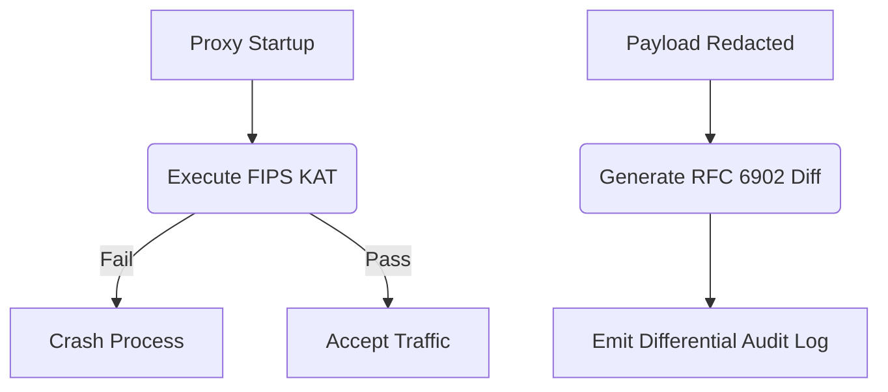

# FIPS 140-3 KAT & RFC 6902 Differential Audit Logging

[⬅️ Back to Features Catalog](/docs/features-overview)

## What It Does
This feature provides cryptographic implementation self-tests and structured mutation metadata that can support federal control evidence. A Known Answer Test is not FIPS 140-3 validation, FedRAMP authorization, or DoD IL5 approval; those depend on the validated module, platform, configuration, and assessment boundary.

## How It Works
Some assurance programs require evidence that cryptographic primitives pass known-answer self-tests and that application transformations are recorded. These artifacts are narrower than cryptographic-module validation or proof of complete runtime behavior.

1. **Cryptographic KAT:** At application startup, the proxy runs fixed SHA-256 and AES-256-GCM test vectors. With `FIPS_STRICT_MODE=true`, a failure aborts startup. Passing these application-level tests is not a FIPS 140-3 module validation or deployment certification.
2. **RFC 6902 Differential Logging:** Instead of just logging "We redacted PII", the proxy calculates the exact diff between the original prompt and the redacted prompt. It emits an RFC 6902 compliant JSON Patch array (e.g., `[{"op": "replace", "path": "/messages/0/content", "value": "***"}]`).

View diagram on GitHub mobile 📱 -->

## Performance Profile
- **Performance:** Workload and environment dependent; measure this path under the published benchmark protocol.
- **Overhead:** The KAT runs at startup; RFC 6902 output adds serialization and evidence volume when supplied. Measure both in the deployment profile.

## Configuration Flags

| Environment Variable | Description | Linked Deployment Guide |
| :--- | :--- | :--- |
| `FIPS_STRICT_MODE` | Aborts startup when the application-level KAT fails. It does not itself disable every non-FIPS algorithm in the process. | [View in deployment.md](/docs/deployment) |
| `AUDIT_LOG_FORMAT` | Set to `RFC6902_DIFF` to include caller-supplied patch operations in supported audit events. | [View in deployment.md](/docs/deployment) |

## Critical Logic & Edge Cases
* **Host OS dependency:** A FIPS claim requires an appropriately validated cryptographic module operated within its security policy. The proxy's self-test does not confer that status on Python, OpenSSL, the host, or the deployment.
* **Data minimization intent:** Differential events are designed to record replacement metadata rather than the original matched value. Verify exception, serialization, debug, exporter, and downstream log paths with adversarial fixtures before relying on that boundary.

## FAQ

**Q: Does enabling `FIPS_STRICT_MODE` slow down the proxy?**
A: The KAT checks fixed primitive operations at startup. Cipher availability and TLS policy depend on the linked cryptographic module and runtime configuration, and the startup test has measurable cost.

**Q: Why is RFC 6902 better than standard logging?**
A: RFC 6902 is machine-readable, so a reviewer can reproduce documented patch operations on supplied artifacts. That does not prove that no omitted operation, alternate path, or logging event occurred.

## Plainspeak
This feature provides a narrow, reproducible startup self-test and optional structured mutation metadata for reviewers.

With strict mode enabled, startup runs fixed cryptographic test vectors and aborts on a failed self-test. A passing application-level known-answer test detects some implementation or environment faults; it does not establish FIPS validation, key safety, or correct operation for every later request.

## Related Tests
See the following test file for reference implementations and edge-case testing: [`tests/test_fips_and_audit_diff.py`](https://github.com/ninadphalak/LLM-Shield-Proxy/blob/main/tests/test_fips_and_audit_diff.py).
