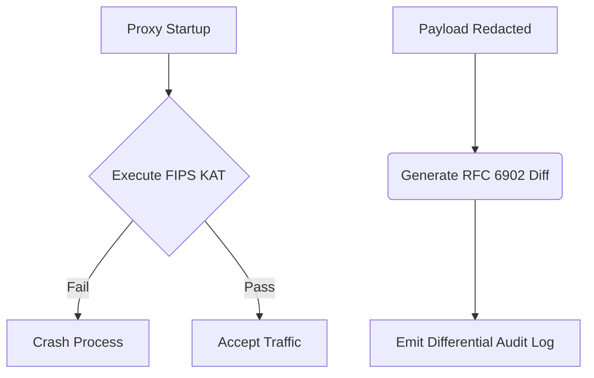

# FIPS 140-3 KAT & RFC 6902 Differential Audit Logging

[⬅️ Back to Features Catalog](/docs/features-overview)

## What It Does
This feature provides cryptographic self-tests at startup and structured metadata for payload mutations. While useful for federal control evidence, it does not magically grant FIPS 140-3 validation or FedRAMP authorization to your deployment.

## How It Works

1. **Cryptographic KAT:** At startup, the proxy runs Known Answer Tests (KAT) for SHA-256 and AES-256-GCM. If `FIPS_STRICT_MODE=true`, a failure immediately aborts startup.
2. **RFC 6902 Mutation Metadata:** The proxy can optionally record JSON Patch operations (e.g., `[{"op": "replace", "path": "/messages/0/content", "value": "***"}]`) in the audit log instead of logging the full original and redacted payloads.

## Performance Profile
- **Overhead:** The KAT runs only at startup. Emitting RFC 6902 diffs adds minor serialization overhead during payload redaction.

## Configuration Flags

| Environment Variable | Description | Linked Guide |
| :--- | :--- | :--- |
| `FIPS_STRICT_MODE` | Aborts startup if the application-level KAT fails. | [View in deployment.md](/docs/deployment) |
| `AUDIT_LOG_FORMAT` | Set to `RFC6902_DIFF` to emit JSON Patch operations for redactions. | [View in deployment.md](/docs/deployment) |

## Implementation Details & Edge Cases
* **Host OS Dependency:** A true FIPS claim requires a validated cryptographic module operated within its security policy. The proxy's application-level KAT does not confer this status on the host OS, OpenSSL, or Python environment.
* **Data Minimization:** RFC 6902 diffs are designed to record *that* a mutation occurred without retaining the sensitive data that was replaced.

## FAQ

**Q: Does enabling `FIPS_STRICT_MODE` slow down the proxy?**
A: No, it only executes a fixed set of checks during startup. It does not slow down active request processing.

**Q: Why is RFC 6902 better than standard logging?**
A: It is machine-readable and explicitly documents patch operations, satisfying specific compliance requirements for audit trails without leaking the original sensitive data into the log.

## Practical Effect
This feature enforces a narrow cryptographic self-test at startup and optionally provides structured, data-minimized audit logs for payload mutations. It supports compliance evidence but does not replace formal module validation.

## Related Tests
Tests: [`tests/test_fips_and_audit_diff.py`](https://github.com/ninadphalak/LLM-Shield-Proxy/blob/main/tests/test_fips_and_audit_diff.py).
