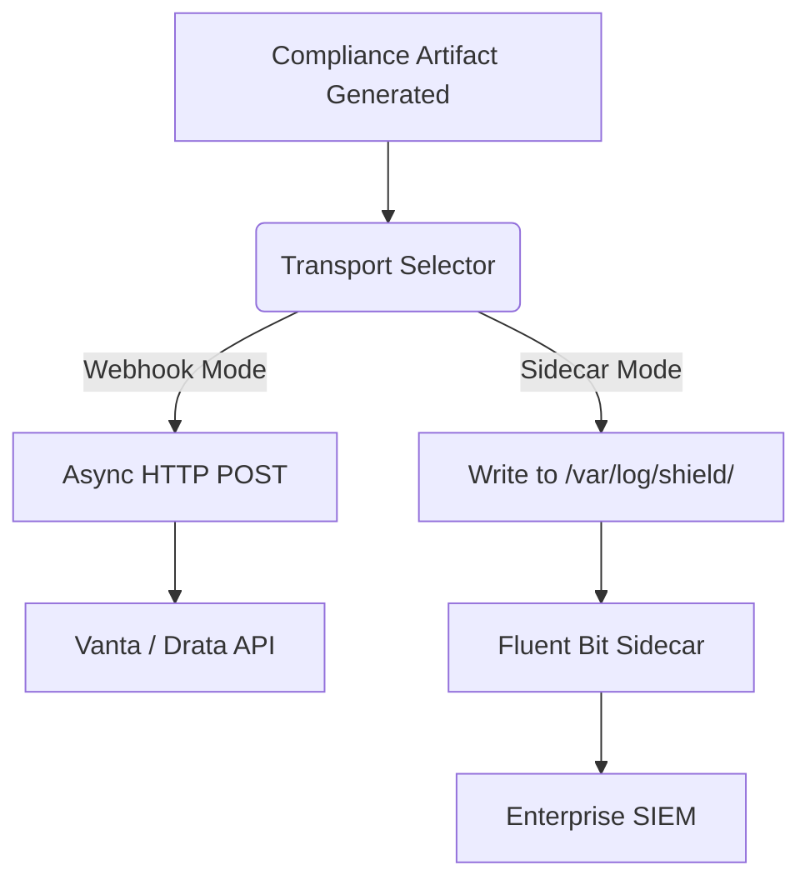

# GRC Webhook & Sidecar File Transport

[⬅️ Back to Features Catalog](/docs/features-overview)

## What It Does
The **GRC Webhook & Sidecar File Transport** is a pluggable integration layer that actively pushes strict compliance artifacts (like NIST OSCAL evaluations and Audit Logs) to external Governance, Risk, and Compliance (GRC) platforms such as Vanta, Drata, Sprinto, or internal SIEMs, automating continuous compliance monitoring.

## How It Works
Compliance platforms require continuous evidence that security controls (like PII redaction) are actively functioning. Polling logs is slow and error-prone. The proxy uses a push-based architecture:

1. **Transport Layer Selection:** The proxy can be configured to use either a Webhook Transport (HTTP Push) or a Sidecar Transport (File Append).
2. **Webhook Mode:** The proxy aggregates compliance artifacts and fires an asynchronous HTTP `POST` to the configured GRC endpoint, complete with secure authentication headers.
3. **Sidecar Mode:** The proxy uses `aiofiles` to asynchronously append the artifacts to a shared ephemeral volume (e.g., `/var/log/shield/`). A Kubernetes sidecar container (like Fluent Bit or an enterprise agent) tails this file and handles the secure delivery to the GRC platform.

View diagram on GitHub mobile 📱 -->

## Performance Profile
- **Execution Speed:** `aiofiles` disk writes execute in `&lt;1ms`. Async webhooks utilize non-blocking `httpx`.
- **Overhead:** Extremely low. Designed to prevent slow GRC APIs from impacting the LLM data plane.

## Configuration Flags

| Environment Variable | Description | Linked Deployment Guide |
| :--- | :--- | :--- |
| `GRC_TRANSPORT_MODE` | Set to `WEBHOOK` or `SIDECAR`. | [View in deployment.md](/docs/deployment) |
| `GRC_WEBHOOK_URL` | The destination API endpoint (if using Webhook mode). | [View in deployment.md](/docs/deployment) |
| `GRC_SIDECAR_FILE_PATH` | The local file path for appending artifacts (if using Sidecar mode). | [View in deployment.md](/docs/deployment) |

## Critical Logic & Edge Cases
* **Retry Mechanics:** The Webhook transport utilizes the proxy's native exponential backoff engine. If the GRC platform API is temporarily down, the proxy will gracefully buffer and retry the delivery.
* **Volume Mounts:** In Kubernetes, Sidecar Mode requires a shared `emptyDir` or `hostPath` volume mounted simultaneously to the proxy container and the logging sidecar container.

## FAQ

**Q: Why use Sidecar Mode instead of just blasting webhooks everywhere?**
A: In highly secure, air-gapped environments (like FedRAMP High), pods are often strictly forbidden from initiating outbound HTTP connections to the public internet. Sidecar Mode allows the proxy to dump logs locally, letting a dedicated, heavily audited DaemonSet handle the secure egress via internal mTLS proxies.

**Q: Can I use both modes at the same time?**
A: Currently, the architecture supports a single primary transport mode for GRC artifacts to prevent redundant processing, though standard `stdout` JSON logs are always emitted concurrently.

## Plainspeak
This feature acts as an automated courier that delivers compliance reports directly to the platforms that manage your company's security audits.

When the proxy makes security decisions, those logs are useless if they just sit on a server. This feature automatically bundles up the audit logs and instantly transmits them (via webhooks or sidecar files) straight into external audit software (like Vanta or Drata). This means your company's security score updates in real-time, completely automatically.

## Related Tests
See the following test file for reference implementations and edge-case testing: [`tests/test_audit_remediation.py`](https://github.com/YOUR_ORG/LLM-Shield-Proxy/blob/main/tests/test_audit_remediation.py).
