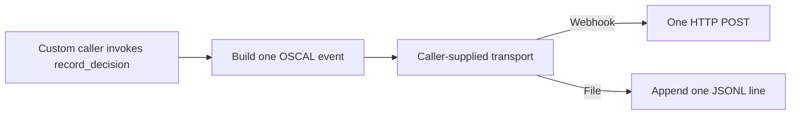

# GRC Webhook & Sidecar File Transport

[⬅️ Back to Features Catalog](/docs/features-overview)

## What It Does
Two Python classes exist for custom evidence delivery. They do nothing in a normal proxy deployment unless application code imports them, constructs them, passes them to `DecisionTraceExporter`, and calls `record_decision(...)`. The catch-all proxy route and `/v1/mcp` do none of those steps.

## How It Works
This is the complete behavior:

1. `AsyncWebhookTransport(url)` creates an `httpx.AsyncClient` with a two-second default timeout.
2. `dispatch(payload)` performs one `POST` to that URL with `payload` as JSON. It adds no GRC-specific authentication header.
3. A timeout, network error, or HTTP 4xx/5xx is logged. The error is not returned to `DecisionTraceExporter`, persisted, or retried.
4. `SidecarFileTransport(path)` appends one JSON object plus a newline to that path. It does not create the parent directory, call `fsync`, rotate the file, or start a sidecar container.
5. The word “sidecar” describes one possible operator topology: another container may mount the same volume and ship the JSONL file. This repository does not create or configure that log-shipping container.

Minimal manual wiring looks like this:

```python
transport = AsyncWebhookTransport("https://internal.example/grc-events")
exporter = DecisionTraceExporter(transports=[transport])
exporter.record_decision(...)
```

No equivalent environment-variable wiring exists in the running FastAPI application.





View diagram on GitHub mobile 📱 -->


## Performance Profile
- **Performance:** Workload and environment dependent; measure this path under the published benchmark protocol.
- **Delivery behavior:** Dispatch runs in retained background tasks, but there is no durable queue or completion acknowledgement. Process termination and destination failures can lose artifacts.

## Configuration

There are no `GRC_TRANSPORT_MODE`, `GRC_WEBHOOK_URL`, or `GRC_SIDECAR_FILE_PATH` settings in the current `Settings` model. Wiring these primitives into the running proxy is an integration task, not an enabled feature flag.

## Critical Logic & Edge Cases
* **Delivery is best-effort:** The exporter creates background tasks and does not wait for a receiving system to persist the event. A process exit can interrupt pending tasks.
* **HTTP status handling:** HTTP 4xx/5xx, timeouts, and request errors are logged as unacknowledged events, but there is no retry or dead-letter queue.
* **File durability:** Closing the file is not the same as an `fsync` durability guarantee. The caller must create the directory and configure permissions, rotation, retention, and any shared Kubernetes volume.

## FAQ

**Q: Does “Sidecar File Transport” inject or launch a Kubernetes sidecar?**
A: No. It only appends JSONL to a file path. An operator must separately define a shared volume and a log-shipping container or DaemonSet.

**Q: Can I use both transports at the same time?**
A: A caller can pass both transport instances to `DecisionTraceExporter`, but the main proxy does not currently expose configuration that does so.


## Practical effect
These are integration primitives for custom evidence delivery, not a ready-to-enable GRC connector.

If custom code calls these classes, they can attempt one HTTP delivery or one file append. They are not a Vanta, Drata, or Sprinto integration, and they are not active in the proxy request path today.

## Related Tests
See [`tests/test_transport.py`](https://github.com/ninadphalak/LLM-Shield-Proxy/blob/main/tests/test_transport.py) for direct class tests. These tests do not demonstrate runtime route wiring or delivery to a GRC vendor.
