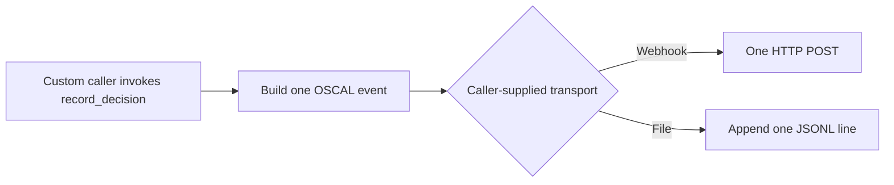

# GRC Webhook & Sidecar File Transport

[⬅️ Back to Features Catalog](/docs/features-overview)

## What It Does
This repository provides two Python classes (`AsyncWebhookTransport` and `SidecarFileTransport`) for custom evidence delivery to Governance, Risk, and Compliance (GRC) tools. 

**Important:** These are integration primitives. They do nothing in a normal proxy deployment unless you write custom Python code to instantiate them and wire them into the `DecisionTraceExporter`.

## How It Works
If manually wired into the proxy via custom code:

1. `AsyncWebhookTransport(url)` performs a single `POST` request to a webhook URL containing the JSON payload. It does not add GRC-specific authentication headers.
2. `SidecarFileTransport(path)` appends a single JSON object plus a newline to a file path.

```python
# Example of manual wiring required in custom application code
transport = AsyncWebhookTransport("https://internal.example/grc-events")
exporter = DecisionTraceExporter(transports=[transport])
exporter.record_decision(...)
```



## Performance Profile
- **Overhead:** Webhook dispatch runs as a background task. File transport performs blocking I/O (appends).

## Configuration Flags
There are **no** environment variables (like `GRC_WEBHOOK_URL`) to enable these in the standard FastAPI proxy. You must write custom Python code to use them.

## Implementation Details & Edge Cases
* **Best-Effort Delivery:** Webhook delivery does not implement retries or dead-letter queues. If the destination is unreachable, the event is logged as an error and dropped.
* **File Durability:** The file transport appends to a file but does not call `fsync` or rotate the file. You must configure directory permissions, log rotation, and any shared Kubernetes volume (for a sidecar pattern) yourself.

## FAQ

**Q: Does "Sidecar File Transport" automatically launch a Kubernetes sidecar?**
A: No. It simply writes to a file. You are responsible for configuring the Kubernetes Pod to share a volume with a log-shipping sidecar (like Fluentbit).

**Q: Can I use this out-of-the-box to send logs to Vanta or Drata?**
A: No. These are raw primitives. You would need to write an adapter to handle the specific authentication and payload schema required by your GRC vendor.

## Practical Effect
These classes are building blocks for developers extending the proxy. They are not active out-of-the-box and require custom code and infrastructure to function.

## Related Tests
Tests: [`tests/test_transport.py`](https://github.com/ninadphalak/LLM-Shield-Proxy/blob/main/tests/test_transport.py).
