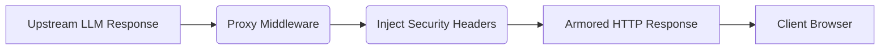

# Security Response Headers

[⬅️ Back to Features Catalog](/docs/features-overview)

## What It Does
The **Security Response Headers** middleware adds configured headers to responses that traverse the middleware stack. Some server, framework, proxy, and early-failure responses can follow different paths, so verify success, streaming, error, and infrastructure-generated responses.

## How It Works
Modern web security requires strict directives to prevent browsers from executing malicious behaviors (like MIME-sniffing or clickjacking).

1. **Middleware Injection:** A FastAPI middleware layer adds headers to responses that traverse that application path.
2. **Configured values:** The middleware sets the documented header values; infrastructure-generated or bypass responses require separate verification.
3. **The Headers:**
   - `X-Content-Type-Options: nosniff` (Prevents MIME-sniffing vulnerabilities).
   - `X-Frame-Options: DENY` (Prevents Clickjacking by disallowing iframe embedding).
   - `Strict-Transport-Security: max-age=31536000; includeSubDomains` (HSTS: Forces all future connections from the client to use HTTPS for the next year).

View diagram on GitHub mobile 📱 -->

## Performance Profile
- **Performance:** Workload and environment dependent; measure this path under the published benchmark protocol.
- **Overhead:** Header construction and middleware dispatch perform work; measure the complete request path under the published protocol.

## Configuration Flags
These headers provide browser hardening defaults; they do not establish OWASP compliance or replace application-specific CSP, CORS, TLS, cookie, and content-handling review.

## Critical Logic & Edge Cases
* **HSTS Preloading:** The `Strict-Transport-Security` header includes a 1-year `max-age`. If the proxy is accidentally exposed over plain HTTP (port 80) without a TLS terminator in front of it, browsers will forcefully upgrade subsequent requests to HTTPS.
* **CORS interaction:** Security and CORS headers are configured separately, but browser behavior depends on their combined values. Test the intended origins, methods, credentials, and error responses.

## FAQ

**Q: Do these headers affect Server-Sent Events (SSE)?**
A: The application middleware is intended to add them to the initial SSE response. Verify this through the selected ASGI server, ingress, error path, and TLS terminator; the headers do not encrypt transport by themselves.

## Plainspeak
These response headers ask compatible browsers to disable MIME sniffing, framing, and future plaintext HTTP access for the configured host. Their effect depends on HTTPS, browser support, intermediaries, and the rest of the application's security policy.

## Related Tests
See the following test file for reference implementations and edge-case testing: [`tests/test_security_hardening.py`](https://github.com/ninadphalak/LLM-Shield-Proxy/blob/main/tests/test_security_hardening.py).
