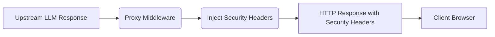

# Security Response Headers

[⬅️ Back to Features Catalog](/docs/features-overview)

## What It Does
The proxy injects standard browser security headers into HTTP responses that traverse its middleware stack. This provides baseline hardening for web clients, but does not replace application-specific CORS, CSP, or TLS configurations.

## How It Works
A FastAPI middleware intercepts outbound responses and sets the following headers:

* `X-Content-Type-Options: nosniff`: Prevents browsers from guessing a different content type than declared.
* `X-Frame-Options: DENY`: Prevents the response from being embedded in a `<frame>` or `<iframe>`, mitigating clickjacking.
* `Strict-Transport-Security: max-age=31536000; includeSubDomains`: Forces compatible browsers to use HTTPS for the host and all subdomains for one year.

## Performance Profile
- **Overhead:** Appending HTTP headers via middleware has negligible performance impact.

## Configuration Flags
These headers are hardcoded into the middleware to provide secure defaults. They are not toggleable via environment variables.

## Implementation Details & Edge Cases
* **HSTS Scope:** The `Strict-Transport-Security` header includes `includeSubDomains`. Ensure this is appropriate for your environment, as it will force HTTPS on all subdomains. Browsers only honor this after receiving it over an initial HTTPS connection.
* **Middleware Path:** These headers are only injected on paths that execute the FastAPI middleware. Responses generated by an ingress controller, TLS terminator, or early proxy crashes may not include them.

## FAQ

**Q: Do these headers encrypt the traffic?**
A: No. HSTS forces the *client* to request HTTPS in the future, but the proxy itself must still be deployed behind a TLS terminator (e.g., an Ingress controller) to actually encrypt the connection.

**Q: Do these headers affect Server-Sent Events (SSE)?**
A: Yes, the middleware injects them into the initial HTTP response that establishes the SSE stream.

## Practical Effect
This middleware asks compatible web browsers to enforce strict HTTPS, disable MIME sniffing, and block framing, providing baseline defense-in-depth for clients interacting directly with the proxy.

## Related Tests
Tests: [`tests/test_security_hardening.py`](https://github.com/ninadphalak/LLM-Shield-Proxy/blob/main/tests/test_security_hardening.py).
