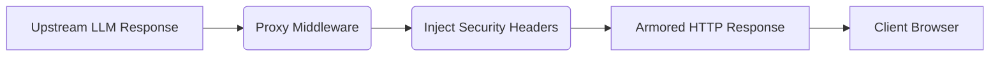

# Security Response Headers on All Responses

[⬅️ Back to Features Catalog](../../../features-overview.md)

## What It Does
The **Security Response Headers** feature ensures that every single HTTP response emitted by the proxy—whether it is a successful LLM stream, a 400 error, or a 503 load-shedding rejection—is automatically armored with industry-standard HTTP security headers. This protects client applications and browsers interacting with the proxy from common web vulnerabilities.

## How It Works
Modern web security requires strict directives to prevent browsers from executing malicious behaviors (like MIME-sniffing or clickjacking).

1. **Middleware Injection:** The proxy utilizes a FastAPI middleware layer that intercepts every outbound `Response` object immediately before it is flushed to the network socket.
2. **Deterministic Appends:** It forcefully injects specific headers, regardless of what the upstream LLM provided.
3. **The Headers:**
   - `X-Content-Type-Options: nosniff` (Prevents MIME-sniffing vulnerabilities).
   - `X-Frame-Options: DENY` (Prevents Clickjacking by disallowing iframe embedding).
   - `Strict-Transport-Security: max-age=31536000; includeSubDomains` (HSTS: Forces all future connections from the client to use HTTPS for the next year).

View diagram on GitHub mobile 📱 -->

## Performance Profile
- **Execution Speed:** Dictionary insertion executes in `&lt;0.1µs`.
- **Overhead:** Zero measurable overhead.

## Configuration Flags
These headers are hardcoded into the security middleware to ensure baseline OWASP compliance and cannot be disabled without modifying the source code.

## Critical Logic & Edge Cases
* **HSTS Preloading:** The `Strict-Transport-Security` header includes a 1-year `max-age`. If the proxy is accidentally exposed over plain HTTP (port 80) without a TLS terminator in front of it, browsers will forcefully upgrade subsequent requests to HTTPS.
* **CORS Compatibility:** These security headers operate completely independently of Cross-Origin Resource Sharing (CORS) headers, meaning they will not interfere with `Access-Control-Allow-Origin` configurations required by your frontend applications.

## FAQ

**Q: Do these headers affect Server-Sent Events (SSE)?**
A: Yes. The headers are applied to the initial HTTP 200 OK response that establishes the SSE connection, securing the stream at the transport layer before the delta chunks begin arriving.

## Plainspeak
This feature adds an invisible armor plating to the web browser when communicating with the proxy.

When an app connects to the internet, hackers often try tricky browser attacks (like secretly embedding your chat window inside a malicious website to steal clicks). This feature forcefully attaches strict security instructions to every single response, ordering the user's web browser to instantly block those types of attacks.

## Related Tests
See the following test file for reference implementations and edge-case testing: [`tests/test_security_hardening.py`](../../../tests/test_security_hardening.py).
