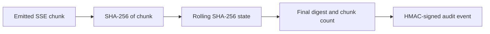

# Signed SSE Stream Digest Receipt

[⬅️ Back to Features Catalog](/docs/features-overview)

## What It Does
The **StreamDigestReceipt** maintains a rolling SHA-256 cryptographic digest over the Server-Sent Event (SSE) chunks emitted by the proxy. When the stream completes, it emits an HMAC-signed audit event containing this final digest. This allows an auditor to cryptographically verify that the exact bytes recorded in a downstream log match what the proxy emitted.

## How It Works
The receipt proves what the proxy emitted, but it is not a full packet capture.

1. **Rolling Digest:** As the proxy yields SSE chunks to the client, it continuously updates a running SHA-256 state with the bytes of each chunk.
2. **Finalization:** When the stream completes, the proxy extracts the final digest.
3. **Signature:** The proxy signs the digest, chunk count, session ID, and timestamp using `SHIELD_ENCRYPTION_KEY`.
4. **Audit Log:** The signed `stream_digest_receipt` event is written to the configured audit sink.

## Performance Profile
- **Overhead:** Hashing occurs incrementally on each chunk. The single HMAC signature operation runs at the very end of the stream. CPU impact is minimal but scales with stream length and byte volume.

## Configuration Flags

| Environment Variable | Description | Linked Guide |
| :--- | :--- | :--- |
| `SHIELD_ENCRYPTION_KEY` | Required. The symmetric HMAC key used to sign the digest. | [View in deployment.md](/docs/deployment) |

## Implementation Details & Edge Cases
* **Evidence Boundary:** The digest only proves what bytes the proxy *attempted* to send. It does not prove what the client actually received (due to network drops), nor what the upstream LLM originally sent (before redaction).
* **Identity:** Because HMAC is symmetric, anyone with the `SHIELD_ENCRYPTION_KEY` can generate valid signatures. Keep the key secure.

## FAQ

**Q: Does this prove no PII was leaked?**
A: No. It only proves the exact sequence of bytes emitted. You must still verify that the proxy's redaction logic operated correctly on the upstream payload.

## Practical Effect
This feature emits a cryptographic checksum of an entire LLM streaming response, enabling auditors to detect if downstream systems tampered with or truncated the response logs.

## Related Tests
Tests: 
- `tests/test_attestation.py`
