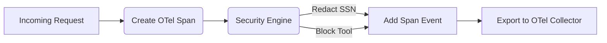

# Decision Trace Exporter

[⬅️ Back to Features Catalog](/docs/features-overview)

## What It Does
The **Decision Trace Exporter** adds supported proxy decision metadata to OpenTelemetry (OTel) traces. It covers instrumented paths and enabled exporters, not every security boundary or decision.

## How It Works
The exporter turns selected decision fields into OpenTelemetry spans when application code calls
it.

1. **Explicit invocation:** A caller constructs `DecisionTraceExporter` and calls `record_decision(...)`; the current catch-all and MCP routes do not invoke it automatically.
2. **Span emission:** That method creates a `gen_ai.client.operation.tool_call` span and attaches the fields present in its arguments.
3. **Optional transport dispatch:** Caller-supplied GRC transports receive a single-event OSCAL payload in background tasks. Sampling, queue limits, failures, and downstream processing can omit or delay data.

View diagram on GitHub mobile 📱 -->

## Performance Profile
- **Performance:** Workload and environment dependent; measure this path under the published benchmark protocol.
- **Overhead:** Depends on the configured OpenTelemetry provider/processors and any caller-supplied transports. The class itself does not guarantee a batch processor.

## Configuration Flags

| Environment Variable | Description | Linked Deployment Guide |
| :--- | :--- | :--- |
The proxy's current telemetry settings are `TELEMETRY_ENABLED`, `TELEMETRY_ENDPOINT_URL`, and `TELEMETRY_API_KEY`. There is no `ENABLE_DECISION_TRACES` setting, and the runtime routes do not automatically wire this exporter.

## Critical Logic & Edge Cases
* **Data minimization:** The exporter is designed to emit decision metadata rather than matched values. Validate exceptions, custom attributes, resource metadata, processors, and downstream exporters with no-PII tests.
* **Trace context propagation:** The proxy parses supported W3C `traceparent` input and can continue that trace locally. Whether the context remains continuous through ingress, proxy, upstream provider, and collectors depends on each component's propagation and trust policy.

## FAQ

**Q: Can I view these decision traces in Datadog or New Relic?**
A: These products accept OTLP in supported configurations, but endpoint format, authentication, processors, sampling, and field mapping differ. Validate with a no-PII test event and confirm which attributes arrive before production use.

**Q: Does this replace signed audit evidence?**
A: No. OTel traces are designed for observability and may be sampled or retained briefly. The audit chain is a separate evidence path; use durable delivery and independently configured immutable retention where required.

## Practical effect
This feature packages selected decision metadata into OpenTelemetry spans so a configured collector can process it. Treat the resulting traces as sampled observability data, not a complete or durable audit record.

## Related Tests
Tests: [`tests/test_audit_remediation.py`](https://github.com/ninadphalak/LLM-Shield-Proxy/blob/main/tests/test_audit_remediation.py).
