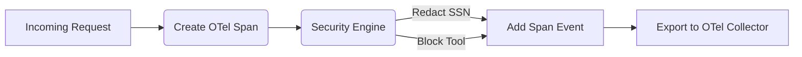

# Universal Decision Trace Exporter

[⬅️ Back to Features Catalog](/docs/features-overview)

## What It Does
The **Universal Decision Trace Exporter** provides unified observability across all security boundaries. Rather than having scattered logs in one system and network traces in another, this engine aggregates every single security decision (regex matches, policy evaluations, and tool-call RBAC blocks) and seamlessly weaves them into your existing OpenTelemetry (OTel) distributed traces.

## How It Works
Modern cloud infrastructure relies heavily on distributed tracing (Jaeger, Zipkin, Datadog) to understand request lifecycles.

1. **Span Enrichment:** When the proxy initiates a trace span for an incoming HTTP request, the Decision Trace Exporter attaches to the active context.
2. **Lifecycle Aggregation:** Every time the Tier 1, 2, or 3 engines make a redaction decision, or the RBAC engine blocks a tool, an "event" is dynamically appended to the active OTel Span.
3. **Structured Export:** When the request completes, the span is exported via gRPC/HTTP directly to the OpenTelemetry Collector, carrying all the security metadata perfectly synchronized with the network latency data.

View diagram on GitHub mobile 📱 -->

## Performance Profile
- **Execution Speed:** In-memory span enrichment executes in `O(1)` (`&lt;0.5µs`).
- **Overhead:** Uses standard `opentelemetry-api` asynchronous batched exporters to prevent the network from blocking the event loop.

## Configuration Flags

| Environment Variable | Description | Linked Deployment Guide |
| :--- | :--- | :--- |
| `OTEL_EXPORTER_OTLP_ENDPOINT` | The URL of your OpenTelemetry Collector. | [View in deployment.md](/docs/deployment) |
| `ENABLE_DECISION_TRACES` | Toggles the deep enrichment of security events into spans. | [View in deployment.md](/docs/deployment) |

## Critical Logic & Edge Cases
* **Data Sanitization:** The exporter strictly enforces that the actual PII strings (e.g., the real credit card number) are NEVER appended to the OTel Span events. It only logs the metadata (e.g., `decision: redact`, `entity_type: CREDIT_CARD`, `engine: tier_1`).
* **Trace Context Propagation:** It fully supports W3C `traceparent` headers. If your frontend application generates a trace ID and sends it via HTTP header, the proxy seamlessly adopts it, ensuring a single continuous trace from the React UI all the way to the OpenAI server.

## FAQ

**Q: Can I view these decision traces in Datadog or New Relic?**
A: Yes! By pointing the `OTEL_EXPORTER_OTLP_ENDPOINT` to your Datadog Agent or New Relic OTLP ingest endpoint, all the proxy's security decisions will natively appear as events within their tracing UI.

**Q: Does this replace the WORM-Compliant Audit Logs?**
A: No. OTel Traces are designed for developer observability, debugging, and performance monitoring (they are typically sampled and have short retention). WORM-Compliant logs are for strict legal compliance and are never sampled. The proxy runs both simultaneously.

## Plainspeak
This feature translates the proxy's complex security decisions into a standard format that corporate monitoring tools can easily understand.

Instead of hiding its security actions in messy text files, this feature packages every decision (like why it blocked a specific word) into highly structured, government-standard data packets. It then broadcasts these packets so that your company's existing dashboards and monitoring screens can display the security data beautifully and clearly.

## Related Tests
See the following test file for reference implementations and edge-case testing: [`tests/test_audit_remediation.py`](https://github.com/YOUR_ORG/LLM-Shield-Proxy/blob/main/tests/test_audit_remediation.py).
