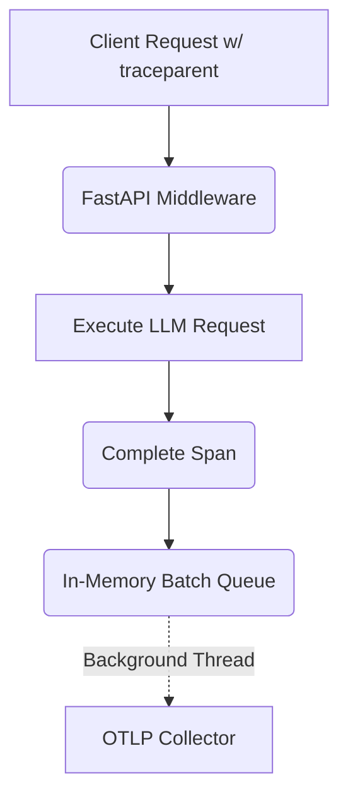

# Zero-Overhead OpenTelemetry (OTel) Tracing

[⬅️ Back to Features Catalog](../../../features-overview.md)

## What It Does
**Zero-Overhead OpenTelemetry (OTel) Tracing** allows the LLM-Shield-Proxy to emit deep, distributed network traces without introducing any latency penalties to the critical data path. It ensures that observability never comes at the cost of performance, even when handling thousands of concurrent LLM streams.

## How It Works
Traditional implementations of OpenTelemetry in Python often block the main thread when exporting trace data to the collector over the network, drastically reducing the proxy's tokens-per-second (TPS) throughput.

1. **W3C Header Propagation:** The proxy intercepts incoming W3C `traceparent` headers and initializes an active span.
2. **Contextvars Isolation:** The active span is bound to the specific `asyncio` task using `contextvars`, completely isolating it from other concurrent user requests.
3. **Background Export:** Instead of using synchronous network calls, the proxy utilizes the `opentelemetry-sdk`'s `BatchSpanProcessor`. This processor queues completed spans in memory and flushes them to the OTLP collector asynchronously using a dedicated background daemon thread.

View diagram on GitHub mobile 📱 -->

## Performance Profile
- **Execution Speed:** Span creation and queuing takes `&lt;1µs`. Network export happens out-of-band.
- **Overhead:** Background thread execution completely shields the Python GIL (Global Interpreter Lock) from network I/O latency.

## Configuration Flags

| Environment Variable | Description | Linked Deployment Guide |
| :--- | :--- | :--- |
| `OTEL_TRACES_SAMPLER` | Configures trace sampling (e.g., `always_on`, `parentbased_traceidratio`). | [View in deployment.md](../../deployment.md) |
| `OTEL_BSP_MAX_QUEUE_SIZE` | The maximum number of spans to buffer in memory before dropping (default 2048). | [View in deployment.md](../../deployment.md) |

## Critical Logic & Edge Cases
* **Graceful Degradation:** If the downstream OTLP collector (e.g., Jaeger) goes offline, the in-memory queue will eventually fill up. The proxy gracefully drops new spans with a silent telemetry error rather than crashing the pod or blocking user traffic.
* **Sampling:** For high-volume enterprise deployments, emitting a trace for every single token chunk is excessively expensive. The proxy fully respects OTel ratio samplers (e.g., sampling 5% of requests) to manage observability costs.

## FAQ

**Q: Is there any scenario where OTel will slow down the user's prompt generation?**
A: No. Because the `BatchSpanProcessor` offloads the HTTP/gRPC export to a separate OS thread, a slow Jaeger collector will never cause a delay in the proxy's `asyncio` event loop.

**Q: Do I have to install a sidecar agent to use this?**
A: No. The proxy supports direct OTLP/HTTP and OTLP/gRPC exports. While a sidecar (like the OpenTelemetry Collector) is recommended for production robustness, you can point the proxy directly to Datadog, Honeycomb, or New Relic ingestion endpoints.

## Plainspeak
This feature acts like an ultra-lightweight GPS tracker attached to every request, without slowing down the vehicle.

To monitor the health of the system, we need to track exactly how many milliseconds a request spends in each part of the proxy. However, the act of tracking can sometimes accidentally slow down the system! This feature solves that by assigning the heavy lifting of tracking to a completely separate background worker, ensuring the main traffic flows at maximum speed without any tracking delays.

## Related Tests
See the following test file for reference implementations and edge-case testing: [`tests/test_tracing.py`](../../../tests/test_tracing.py).
