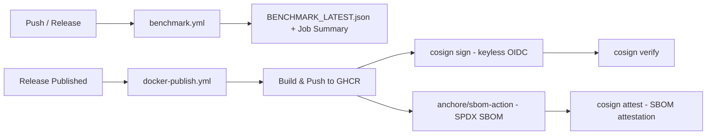

# Reproducible Benchmarks & Signed Supply Chain

[⬅️ Back to Features Catalog](/docs/features-overview)

## What It Does
Vendor latency and memory claims are routinely cherry-picked and unverifiable. This
feature makes LLM-Shield-Proxy's own performance claims the opposite: **continuously
and publicly re-provable**. It pairs that with **Sigstore/cosign-signed, SBOM-attested
container images**, so procurement teams get a verifiable supply chain instead of a
"trust us" checksum file.

## How It Works

### 1. Reproducible Public Benchmark CI
[`.github/workflows/benchmark.yml`](https://github.com/ninadphalak/LLM-Shield-Proxy/blob/main/.github/workflows/benchmark.yml)
re-runs [`benchmarks/benchmark.py`](https://github.com/ninadphalak/LLM-Shield-Proxy/blob/main/benchmarks/benchmark.py)
on every push to `main` and every release:
1. Executes the Shannon-entropy, adversarial-payload-redaction, and resident-memory
   benchmarks.
2. Writes machine-readable results to `BENCHMARK_LATEST.json` (via `benchmark.py
   --json-out`) and uploads it as a workflow artifact.
3. Appends a formatted results table directly to the GitHub Actions Job Summary, so
   anyone can see the exact numbers for the exact commit, without re-running anything
   locally.

### 2. Signed Container Images & SBOM Attestation
[`.github/workflows/docker-publish.yml`](https://github.com/ninadphalak/LLM-Shield-Proxy/blob/main/.github/workflows/docker-publish.yml)
runs on every published GitHub release:
1. Builds and pushes the image to GHCR.
2. Installs `cosign` (`sigstore/cosign-installer`) and **keylessly** signs the image
   digest using GitHub's OIDC identity — no long-lived signing key to leak or rotate.
3. Generates an SPDX SBOM with `anchore/sbom-action` (Syft) and attaches it to the image
   as a signed in-toto attestation via `cosign attest`.
4. Runs `cosign verify` against the freshly published image as a same-workflow sanity
   check.

### 3. Prompt-Template Linter (Composite Action)
[`.github/actions/prompt-linter`](https://github.com/ninadphalak/LLM-Shield-Proxy/tree/main/.github/actions/prompt-linter)
is a reusable composite GitHub Action that runs the same Tier-1 regex and Tier-2
Shannon-entropy heuristics the proxy uses at runtime against `.txt`/`.md` prompt template
files at CI time — catching hardcoded secrets or PII committed into prompt templates
before they ship, in this or any downstream repository that adds the action.

## Performance Profile
- **Execution Speed:** Benchmark CI completes in well under a minute; the Docker
  publish/sign/attest pipeline runs only on release, off the request-serving path
  entirely.
- **Overhead:** Zero runtime overhead — these are build-time and release-time gates, not
  proxy code paths.

## Configuration Flags
These are CI/CD workflows, not runtime engine flags:

| Workflow / Action | Trigger |
| :--- | :--- |
| `.github/workflows/benchmark.yml` | Push to `main`, release published, manual dispatch |
| `.github/workflows/docker-publish.yml` | Release published, manual dispatch |
| `.github/actions/prompt-linter` | Invoked from any workflow via `uses: ./.github/actions/prompt-linter` |

## Critical Logic & Edge Cases
* **No Long-Lived Signing Keys:** `cosign sign`/`attest` use GitHub Actions' OIDC token
  (Sigstore keyless signing via Fulcio + Rekor), so there is no private key material to
  provision as a repository secret or rotate.
* **Benchmark Numbers Are Machine-Environment-Dependent:** `BENCHMARK_LATEST.json`
  reflects the GitHub-hosted runner it executed on, not a dedicated bare-metal box — the
  point is reproducibility and transparency of methodology, not a guaranteed absolute
  number on every machine.
* **Prompt-Linter Is Stdlib-Only:** The composite action's scanner has zero third-party
  Python dependencies by design, so it can be dropped into a downstream repository's CI
  without pulling in the full `llm-shield-proxy` package.

## FAQ

**Q: Why publish benchmark results via CI instead of just the README?**
A: A README number is a one-time snapshot that can quietly go stale or be cherry-picked.
A CI-generated Job Summary is tied to a specific commit and workflow run, is regenerated
on every push, and anyone can re-run the same script themselves against the same commit.

**Q: Why keyless signing instead of a stored cosign key pair?**
A: A stored private key is something that can leak, and someone has to own rotating it.
OIDC-based keyless signing ties every signature to the GitHub Actions run (and therefore
the exact commit and workflow) that produced it, verifiable via the public Rekor
transparency log — with nothing for an attacker to steal.

## Plainspeak
This turns "trust our numbers" into "check our numbers" — the latency and memory claims
in this project's docs are regenerated on every push, not typed into a README once. And
the container image ships with a cryptographic receipt (signature + SBOM) proving exactly
what's inside it and that it came from this repository's CI, not a tampered mirror.

## Related Files
[`benchmarks/benchmark.py`](https://github.com/ninadphalak/LLM-Shield-Proxy/blob/main/benchmarks/benchmark.py),
[`.github/workflows/benchmark.yml`](https://github.com/ninadphalak/LLM-Shield-Proxy/blob/main/.github/workflows/benchmark.yml),
[`.github/workflows/docker-publish.yml`](https://github.com/ninadphalak/LLM-Shield-Proxy/blob/main/.github/workflows/docker-publish.yml),
[`.github/actions/prompt-linter`](https://github.com/ninadphalak/LLM-Shield-Proxy/tree/main/.github/actions/prompt-linter).
