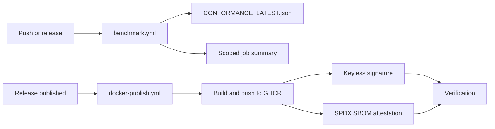

# Reproducible Conformance and Signed Supply Chain

[Back to Features Catalog](/docs/features-overview)

## What It Does

This project publishes a repeatable streaming-privacy conformance method instead of
asking users to trust a headline benchmark. It pairs that method with signed,
SBOM-attested container images so adopters can inspect both behavior and provenance.

## How It Works

### 1. Reproducible conformance CI

[`.github/workflows/benchmark.yml`](https://github.com/ninadphalak/LLM-Shield-Proxy/blob/main/.github/workflows/benchmark.yml)
runs the packaged conformance harness on every push to `main`, every release, and on
manual dispatch. The workflow:

1. Exercises fragmentation safety, raw-PII non-egress, SSE validity, rehydration
   fidelity, audit integrity, component timing, and bounded buffer retention.
2. Writes the versioned, machine-readable result to `CONFORMANCE_LATEST.json`.
3. Adds scoped observations to the GitHub Actions job summary and uploads the JSON as
   a 90-day workflow artifact.

The timing values are in-process component observations. They are not total proxy
latency, network latency, RSS, capacity guarantees, or universal performance targets.

### 2. Signed container images and SBOM attestation

[`.github/workflows/docker-publish.yml`](https://github.com/ninadphalak/LLM-Shield-Proxy/blob/main/.github/workflows/docker-publish.yml)
runs on every published GitHub release:

1. Builds and pushes the image to GHCR.
2. Uses GitHub OIDC and Sigstore to sign the image digest without a stored signing key.
3. Generates an SPDX SBOM and attaches it as a signed in-toto attestation.
4. Verifies the freshly published image in the same workflow.

### 3. Prompt-template linter

[`.github/actions/prompt-linter`](https://github.com/ninadphalak/LLM-Shield-Proxy/tree/main/.github/actions/prompt-linter)
is a reusable action that applies the proxy's Tier 1 regex and Tier 2 entropy checks to
prompt-template files before they ship.



## Runtime Impact

The conformance, signing, and attestation jobs run in CI, not on the request-serving
path. They add no proxy runtime work. Actual runtime performance remains workload and
environment dependent and should be measured under the published protocol.

## Configuration

| Workflow or action | Trigger |
| :--- | :--- |
| `.github/workflows/benchmark.yml` | Push to `main`, release, or manual dispatch |
| `.github/workflows/docker-publish.yml` | Published release or manual dispatch |
| `.github/actions/prompt-linter` | Explicitly included by a repository workflow |

The conformance workflow disables configured OpenTelemetry export so a developer `.env`
file or unreachable collector cannot distort the run. This setting is separate from
anonymous usage tracking and does not change that feature.

## Important Boundaries

- GitHub-hosted runner results describe that runner and commit, not every deployment.
- Python-traced allocations are not process RSS.
- A passing harness demonstrates the tested properties and cases. It is not a general
  certification of every deployment or configuration.
- Keyless image signing avoids repository-held signing keys, but adopters must still
  enforce verification in their own deployment policy.

## Reproduce It

```bash
llm-shield-proxy benchmark --iterations 2000 --json-out CONFORMANCE_LATEST.json
```

Read the [conformance specification](/docs/conformance/specification-v1) and
[reproduction protocol](/docs/conformance/reproducing) before comparing results.

## Related Files

- [`benchmarks/conformance.py`](https://github.com/ninadphalak/LLM-Shield-Proxy/blob/main/benchmarks/conformance.py)
- [`.github/workflows/benchmark.yml`](https://github.com/ninadphalak/LLM-Shield-Proxy/blob/main/.github/workflows/benchmark.yml)
- [`.github/workflows/docker-publish.yml`](https://github.com/ninadphalak/LLM-Shield-Proxy/blob/main/.github/workflows/docker-publish.yml)
- [`.github/actions/prompt-linter`](https://github.com/ninadphalak/LLM-Shield-Proxy/tree/main/.github/actions/prompt-linter)
