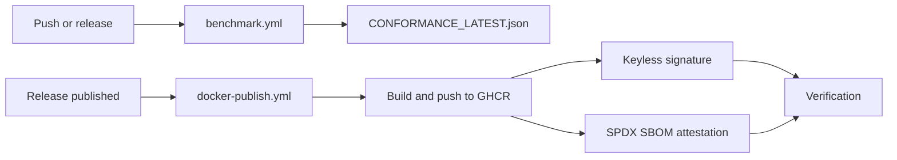

# Reproducible Conformance and Signed Supply Chain

[⬅️ Back to Features Catalog](/docs/features-overview)

## What It Does
The proxy project provides a reproducible CI/CD conformance test suite to empirically validate streaming-privacy behavior, rather than relying on abstract claims. Furthermore, published container images are signed and bundled with SBOM (Software Bill of Materials) attestations to ensure supply chain integrity.

## How It Works

### 1. Reproducible Conformance CI
The `.github/workflows/benchmark.yml` workflow runs on every push to `main` and on releases. It executes a local benchmark testing fragmentation safety, non-egress, SSE validity, rehydration fidelity, and component timing.
* Results are written to `CONFORMANCE_LATEST.json` and uploaded as an artifact.
* Note: Component timings reflect the CI runner's performance, not absolute production latency or memory capacity.

### 2. Signed Container Images and SBOM
The `.github/workflows/docker-publish.yml` workflow runs on releases.
* Builds and pushes the image to GitHub Container Registry (GHCR).
* Uses GitHub OIDC and Sigstore for keyless image signing.
* Attaches an SPDX SBOM as a signed in-toto attestation.

### 3. Prompt-Template Linter
A reusable GitHub Action (`.github/actions/prompt-linter`) allows downstream consumers to run the proxy's regex and entropy checks against their prompt-template files in their own CI pipelines before deployment.



## Performance Profile
- **Overhead:** These processes run entirely within CI/CD pipelines. They have zero impact on proxy runtime performance.

## Implementation Details & Edge Cases
* **Verification:** Keyless signing proves which repository and workflow built the image, but it does not remove the need for you to verify the signatures in your own deployment pipeline (e.g., using Kyverno or Sigstore Cosign).
* **Conformance Limits:** A passing CI benchmark proves the proxy handles the specific test cases successfully. It does not certify that your specific deployment topology or custom configurations are secure.

## Reproduce It
You can run the conformance benchmark locally to verify behavior:
```bash
llm-shield-proxy benchmark --iterations 2000 --json-out CONFORMANCE_LATEST.json
```

## Practical Effect
These CI/CD controls provide transparency and cryptographic provenance for the proxy software, allowing organizations to independently verify the software's behavior and origin before deploying it to production.

## Related Files
- `benchmarks/conformance.py`
- `.github/workflows/benchmark.yml`
- `.github/workflows/docker-publish.yml`
- `.github/actions/prompt-linter`
