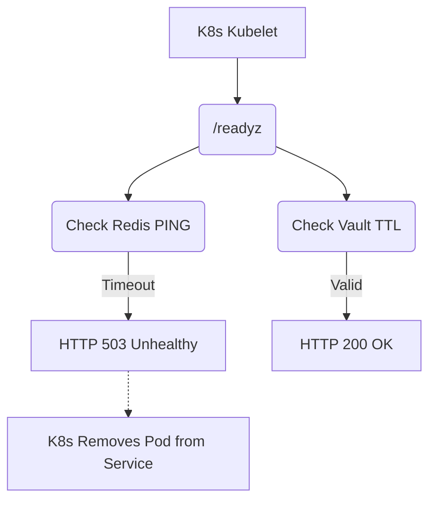

# Component Health Probes and Prometheus Alerts

[⬅️ Back to Features Catalog](/docs/features-overview)

## What It Does
The proxy exposes Kubernetes-native health probes (liveness and readiness) and Prometheus alert rules to monitor the health of the application and its critical dependencies.

## How It Works
Kubernetes uses these probes to determine if a pod should receive traffic or be restarted.

1. **Liveness (`/livez`):** A shallow check. If the HTTP server can respond at all, it returns 200 OK. It does not check dependencies. If this fails, Kubernetes restarts the pod.
2. **Readiness (`/readyz`):** A deep check. It verifies that critical dependencies are functional before accepting traffic. It checks that regex patterns are loaded, Vault (if enabled) has cached secrets, and Redis (if enabled) responds to a `PING` within 0.5 seconds. If this fails, Kubernetes stops sending new traffic to the pod.
3. **Prometheus Alerts:** A bundled Helm chart provides alert expressions for latency, error rates, and probe failures.

## Performance Profile
- **Overhead:** Readiness checks ping dependencies, generating minor network traffic. To prevent self-inflicted load, readiness results are cached for two seconds.

## Configuration Flags
The Redis PING timeout is hardcoded to 0.5 seconds in `api/health.py`. There is no environment variable to adjust this timeout.

## Implementation Details & Edge Cases
* **Graceful Shutdown:** When the proxy receives a `SIGTERM`, it immediately marks the readiness probe as `503` failing. Active requests are allowed to finish within the drain timeout, but Kubernetes will stop routing new requests to the terminating pod.
* **Upstream LLM Failures:** The readiness probe *does not* ping OpenAI or Anthropic. A pod will report as "ready" even if the upstream provider is completely down. Readiness measures the proxy's internal capability to process requests, not the upstream provider's status.

## FAQ

**Q: Where can I find the Prometheus Alert Rules?**
A: The repository includes a `prometheus-rules.yaml` file in the `/deploy/` directory containing the recommended alerting thresholds.

## Practical Effect
These probes allow Kubernetes to automatically route traffic away from proxy instances that have lost connection to Redis or Vault, minimizing the impact of dependency failures on client traffic.

## Related Tests
Tests: [`tests/test_health_and_alerts.py`](https://github.com/ninadphalak/LLM-Shield-Proxy/blob/main/tests/test_health_and_alerts.py).
