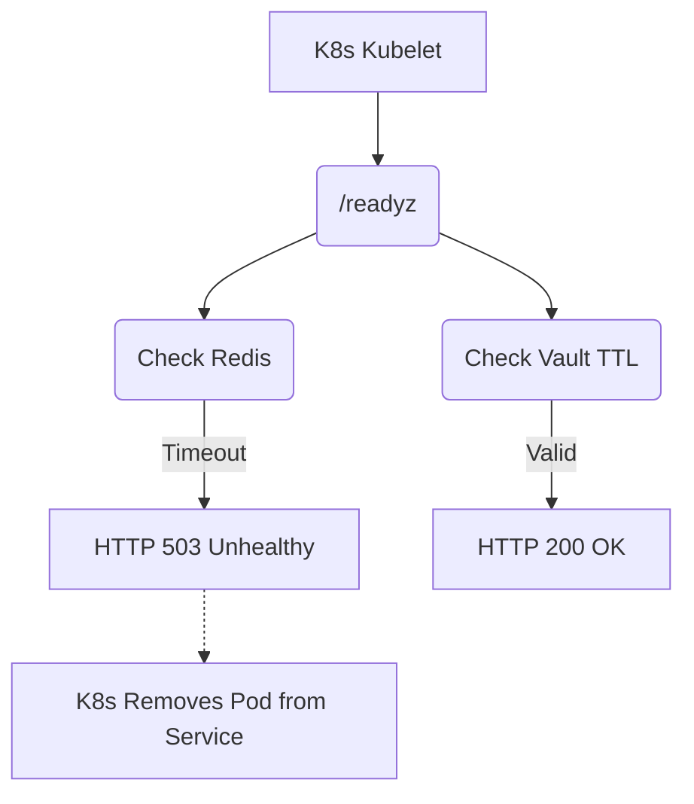

# Component Health Probes and Prometheus Alerts

[⬅️ Back to Features Catalog](/docs/features-overview)

## What It Does
**Deep Component Health Probes** expose selected dependency and process signals to Kubernetes. A successful probe is a point-in-time readiness signal, not proof of security, correctness, future availability, or every upstream path.

## How It Works
Readiness checks let Kubernetes stop routing new traffic to a pod when selected configured
dependencies are unavailable.

1. **Liveness (`/livez`, with `/health` and `/healthz` aliases):** Returns a lightweight application response; it does not exercise dependencies.
2. **Readiness (`/readyz`):** Checks that Tier 1 patterns are present, an enabled ONNX session is loaded, an enabled Vault integration has cached secrets, and a configured Redis store answers a PING within the implementation's fixed timeout.
3. **Prometheus rules:** The Helm chart includes alert expressions. Delivery to an on-call system depends on separately configured Prometheus and Alertmanager infrastructure.

View diagram on GitHub mobile 📱 -->

## Performance Profile
- **Performance:** Workload and environment dependent; measure this path under the published benchmark protocol.
- **Caching:** Readiness results are cached for two seconds. Measure probe load and choose Kubernetes periods and timeouts for the deployment.

## Configuration Flags

| Environment Variable | Description | Linked Deployment Guide |
| :--- | :--- | :--- |
The current Redis PING timeout is fixed at 0.5 seconds in `api/health.py`; there is no `PROBE_REDIS_TIMEOUT` setting.

## Critical Logic & Edge Cases
* **Redis boundary:** If the active vault store is a `RedisVaultStore`, a failed PING makes readiness return 503. The readiness code does not vary that result by masking mode.
* **Pod draining synchronization:** After `SIGTERM`, the application changes readiness to `503`. Kubernetes and ingress convergence take time, and active streams remain bounded by the drain and platform termination deadlines.

## FAQ

**Q: Where can I find the Prometheus Alert Rules?**
A: The repository includes a `prometheus-rules.yaml` file in the `/deploy/` directory, containing best-practice thresholds for latency, error rates, and probe failures.

**Q: Will the probe fail if the upstream LLM is down?**
A: No. The current readiness check makes no upstream request and opens no upstream socket. It can
return 200 while the upstream provider is unavailable.

## Practical effect
The liveness route is shallow, while readiness checks a documented subset of local and configured dependency state. Kubernetes may remove an unready Pod from service; paging depends on the operator's monitoring stack.

## Related Tests
Tests: [`tests/test_health_and_alerts.py`](https://github.com/ninadphalak/LLM-Shield-Proxy/blob/main/tests/test_health_and_alerts.py).
