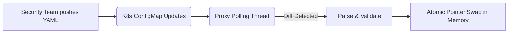

# Role-Based Policy-as-Code & Hot-Reloading

[⬅️ Back to Features Catalog](/docs/features-overview)

## What It Does
**Role-Based Policy-as-Code & Hot-Reloading** lets security teams manage supported proxy settings in a YAML file. The local resolver polls for changes and can replace its in-memory mapping without a process restart; propagation time and in-flight behavior must be tested.

## How It Works
Security policies in large organizations change rapidly. Waiting 10 minutes for a Kubernetes deployment to roll out a new regex rule is unacceptable during an active incident.

1. **GitOps Integration:** Policies are defined in a `policies.yaml` file (mounted via Kubernetes ConfigMap or pulled from an external Git repository).
2. **Asynchronous Polling:** A background `asyncio` task polls the file or network endpoint for a new SHA-256 hash.
3. **Validated replacement:** When a change is detected, the proxy parses and validates the new YAML before replacing the in-memory mapping.
4. **Request-scoped transition:** Requests resolve policy at documented boundaries. In-flight and subsequent requests can observe different versions; measure reload latency and test malformed or partially written policy files.

View diagram on GitHub mobile 📱 -->

## Performance Profile
- **Performance:** Workload and environment dependent; measure this path under the published benchmark protocol.
- **Overhead:** Validating the Pydantic models takes a few milliseconds but runs concurrently on a separate worker thread to protect the main proxy loop.

## Configuration Flags

| Environment Variable | Description | Linked Deployment Guide |
| :--- | :--- | :--- |
| `POLICIES_RELOAD_INTERVAL_SECONDS` | The polling interval for policy-file changes (default 5s). | [View in deployment.md](/docs/deployment) |

## Critical Logic & Edge Cases
* **Validation Safety:** If a security engineer pushes a malformed YAML file (e.g., missing a required field or containing a syntax error), the Pydantic validator will reject it. The proxy will log a high-priority error and *continue using the last known good policy*, preventing an accidental DoS.
* **In-flight streams:** Policy is resolved at documented request boundaries. Add a concurrency test for the selected resolver and version if in-flight consistency is a deployment requirement.

## FAQ

**Q: Can I use this to hot-reload my TLS certificates?**
A: No. TLS certificates and core `google-re2` compilations (BYOR) operate at a lower C++ level and currently require a graceful pod restart to take effect. Hot-reloading strictly applies to the RBAC roles and routing settings in `policies.yaml`.

## Practical effect
The local resolver periodically checks the policy file and replaces the active validated mapping when it detects a change. Reload time includes the polling interval and file propagation; a process crash, invalid file, or dependency failure can still interrupt service.

## Related Tests
See the following test file for reference implementations and edge-case testing: [`tests/test_policy_engine.py`](https://github.com/ninadphalak/LLM-Shield-Proxy/blob/main/tests/test_policy_engine.py).
