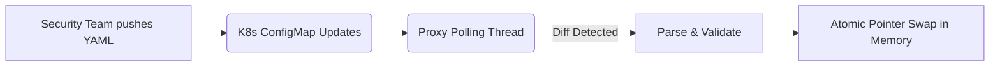

# Role-Based Policy-as-Code & Hot-Reloading

[⬅️ Back to Features Catalog](/docs/features-overview)

## What It Does
**Role-Based Policy-as-Code & Hot-Reloading** allows security teams to manage RBAC roles and routing settings in a YAML file (`policies.yaml`). The proxy periodically polls this file and hot-reloads it in memory without requiring a full process restart.

## How It Works
Waiting for a Kubernetes deployment rollout during an active security incident is too slow.

1. **GitOps Integration:** Policies are defined in a `policies.yaml` file, typically mounted via a Kubernetes ConfigMap.
2. **Asynchronous Polling:** A background task polls the file or network endpoint for a new SHA-256 hash.
3. **Validated Replacement:** When a change is detected, the proxy validates the new YAML structure. If valid, it atomically swaps the in-memory policy reference.
4. **Request-Scoped Transition:** Existing in-flight requests finish using the policy they started with. New requests immediately use the new policy.

## Performance Profile
- **Overhead:** Parsing and validating the YAML takes a few milliseconds but runs concurrently on a background worker thread, ensuring the main proxy event loop is not blocked.

## Configuration Flags

| Environment Variable | Description | Linked Guide |
| :--- | :--- | :--- |
| `POLICIES_RELOAD_INTERVAL_SECONDS` | The polling interval to check for file changes (default 5s). | [View in deployment.md](/docs/deployment) |

## Implementation Details & Edge Cases
* **Validation Safety:** If a malformed YAML file is pushed (e.g., invalid syntax or missing required fields), the proxy rejects it, logs a critical error, and **continues using the last known good policy**. This prevents an accidental Denial of Service (DoS).
* **Propagation Delay:** Reload time includes the polling interval plus the time it takes Kubernetes to propagate ConfigMap updates to the mounted pod volume (which can take up to a minute).

## FAQ

**Q: Can I use this to hot-reload TLS certificates or core regex rules?**
A: No. TLS certificates and core `google-re2` C++ compilations currently require a graceful pod restart. Hot-reloading strictly applies to the RBAC roles and tool governance settings defined in `policies.yaml`.

## Practical Effect
This feature allows rapid iteration and incident response for RBAC and tool governance policies without dropping active proxy connections or requiring full deployment rollouts.

## Related Tests
Tests: [`tests/test_policy_engine.py`](https://github.com/ninadphalak/LLM-Shield-Proxy/blob/main/tests/test_policy_engine.py).
