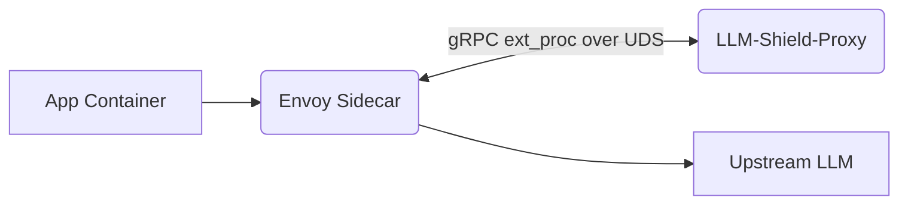

# Service Mesh Native gRPC ext_proc Integration

[⬅️ Back to Features Catalog](/docs/features-overview)

## What It Does
The **gRPC `ext_proc` integration** allows an Envoy proxy (like those used in Istio) to send HTTP request and response bodies directly to the LLM-Shield-Proxy over gRPC for processing, bypassing the standard HTTP reverse proxy path. 

## How It Works
Instead of routing traffic out of the service mesh to the proxy via standard HTTP (which adds TCP handshakes and networking latency), Envoy delegates the payload inspection directly.

1. **Envoy Delegation:** Envoy is configured with an `ext_proc` filter. It sends HTTP body messages to the proxy over a gRPC connection (often via a local Unix Domain Socket).
2. **Buffer Mutation:** The proxy receives the raw HTTP buffers, applies the PII masking cascades, and streams the mutated buffers back to Envoy.
3. **Envoy Forwarding:** Envoy forwards the mutated payload to the upstream LLM. 

## Performance Profile
- **Overhead:** While avoiding extra TCP routing, this path still incurs gRPC message serialization, body buffering, and the CPU cost of the proxy's redaction processing. 

## Configuration Flags

| Environment Variable | Description | Linked Guide |
| :--- | :--- | :--- |
| `ENABLE_EXT_PROC` | Enables the `ext_proc` gRPC listener alongside the HTTP application. | [View in deployment.md](/docs/deployment) |
| `EXT_PROC_SOCK_PATH` | The Unix Domain Socket path (default `/var/run/llm-shield/ext_proc.sock`). | [View in deployment.md](/docs/deployment) |

## Implementation Details & Edge Cases
* **Streaming Responses:** The proxy processes Envoy's incoming `ResponseBody` chunks sequentially, applying the SSE Sliding-Window Buffer logic directly to the gRPC messages.
* **Header Manipulation:** The proxy can instruct Envoy to inject `X-Shield-Attestation` receipts directly into the HTTP headers returning to the client using the gRPC `HeaderMutation` message.

## FAQ

**Q: Can I run this proxy without Istio or Envoy?**
A: Yes. The FastAPI HTTP path and the Envoy `ext_proc` path are separate deployment options. You only enable the one that fits your infrastructure topology.

## Practical Effect
This feature allows seamless integration into advanced service mesh architectures like Istio, allowing Envoy to handle the complex L7 routing while delegating the LLM-specific redaction payload processing to the Shield proxy via a highly efficient local socket.

## Related Tests
Tests: [`tests/test_grpc_ext_proc.py`](https://github.com/ninadphalak/LLM-Shield-Proxy/blob/main/tests/test_grpc_ext_proc.py).
