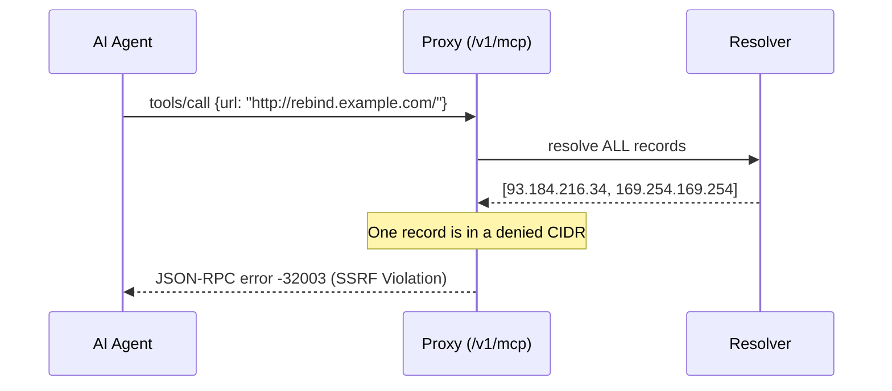

# SSRF & DNS-Rebinding Egress Firewall

[⬅️ Back to Features Catalog](/docs/features-overview)

## What It Does
The **SSRF & DNS-Rebinding Egress Firewall** scans `tools/call` arguments on the `/v1/mcp` route for HTTP/HTTPS URLs. It protects internal networks by resolving the hostnames and blocking the tool execution if any resolved IP address belongs to a restricted internal subnet.

## How It Works
If a language model hallucinates or is prompted to use a "fetch" tool against an internal IP (like `169.254.169.254` or `10.0.0.1`), this constitutes Server-Side Request Forgery (SSRF). The egress firewall blocks this.

1. **AST-Walk Discovery:** The proxy recursively scans the raw `tools/call` arguments for `http(s)://` strings *before* any other sanitization occurs.
2. **Comprehensive DNS Resolution:** The proxy resolves the hostname to *all* associated A/AAAA records. If an attacker's DNS server returns one public IP and one private IP (a rebinding attack technique), the firewall evaluates all of them and blocks the request if *any* record is in a denied CIDR block.
3. **Pinning the IP:** To prevent Time-To-Live (TTL) DNS rebinding attacks, the proxy connects directly to the validated IP address rather than re-resolving the hostname. The original hostname is passed in the `Host` header and TLS SNI extension to maintain virtual-host routing.
4. **Baseline Denylist:** By default, RFC 1918 (10.x, 172.16.x, 192.168.x), loopback (127.x), and cloud metadata (169.254.x) ranges are unconditionally blocked.



## Performance Profile
- **Overhead:** DNS resolution happens asynchronously. A slow DNS server will add latency to the request. The firewall uses a strict `wait_for` timeout to prevent hanging the event loop.

## Configuration Flags
Per-tenant tuning is managed via `policies.yaml`, not environment variables.

```yaml
roles:
  data_analyst:
    allowed_tools: [fetch_url]
    egress_mode: ALLOWLIST_ONLY
    allowed_domains: ["*.internal.corp", "api.github.com"]
    additional_denied_cidrs: ["10.50.0.0/16"] 
```
* `egress_mode`: `DEFAULT_BLOCK` (blocks internal CIDRs) or `ALLOWLIST_ONLY` (requires domain match first).

## Implementation Details & Edge Cases
* **Fail-Closed Semantics:** If DNS resolution times out, errors (NXDOMAIN), or returns zero records, the proxy blocks the request.
* **IPv4-Mapped IPv6 Bypass:** The firewall automatically unwraps addresses like `::ffff:169.254.169.254` to their IPv4 equivalent before checking the CIDR ranges, closing a common bypass technique.

## Practical Effect
This firewall ensures that tools executed via the proxy cannot be weaponized by the LLM to scan or exfiltrate data from your internal, private networks or cloud metadata endpoints.

## Related Tests
Tests: 
- `tests/test_egress_guard.py`
- `tests/test_mcp_routing.py`
