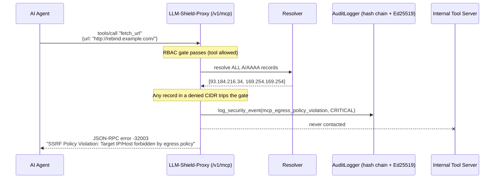

# SSRF & DNS-Rebinding Egress Firewall

[⬅️ Back to Features Catalog](/docs/features-overview)

## What It Does

Autonomous agents don't just read text - via MCP `tools/call`, they hand the proxy URLs
to fetch: webhooks, callback endpoints, "summarize this page" links. An agent that has been
prompt-injected (or a malicious tool definition) can weaponize that into
**Server-Side Request Forgery**: pointing a fetch at `http://169.254.169.254/latest/meta-data/`
(cloud instance credentials), `http://127.0.0.1:6379/` (an internal Redis admin port), or an
RFC 1918 address the agent has no business reaching.

The egress firewall (`llm_shield_proxy/security/egress_guard.py`) intercepts every
`tools/call` on `POST /v1/mcp`, finds every `http://`/`https://` URL anywhere in the
argument tree, and resolves + checks each one **before** the request is ever proxied
upstream. It fails closed: an unresolvable, timed-out, or ambiguous hostname is treated as a
violation, not passed through.

## How It Works

1. **AST-walk argument discovery.** `find_urls()` recursively walks `params.arguments`
   (nested dicts/lists included) collecting every `http(s)://` substring - the same
   AST-walk shape the [3-Tier PII cascade](/docs/guides/mcp-tool-governance) already uses
   for redaction, run on the *raw* pre-sanitization arguments so the host actually being
   evaluated is the one an upstream tool would receive.
2. **Full DNS-rebinding-safe resolution.** For each URL, `evaluate_url()` resolves the
   hostname to *every* A/AAAA record it has (`socket.getaddrinfo` via the asyncio executor,
   under a `wait_for` timeout) and checks **all of them** - not just the first. An attacker
   who answers with one public IP and one `169.254.169.254` record is caught on the second
   record alone.
3. **Baseline denylist, always on.** RFC 1918 (`10.0.0.0/8`, `172.16.0.0/12`,
   `192.168.0.0/16`), loopback (`127.0.0.0/8`, `::1`), link-local/cloud metadata
   (`169.254.0.0/16` - where `169.254.169.254` lives), CGNAT, and the IETF
   documentation/reserved ranges (plus IPv6 equivalents) are blocked unconditionally. There
   is no policy override that re-opens them - only `additional_denied_cidrs` to add more.
4. **Per-virtual-key policy.** `evaluate_url(url, policy)` takes the exact same `dict`
   `BasePolicyResolver.resolve_policy()` already returns for `allowed_tools`/`blocked_tools`
   (see [Pluggable Policy Resolution Engine](/docs/pluggable-rbac-engine)), extended with
   three optional keys:

   ```python
   {
       "egress_mode": "DEFAULT_BLOCK",       # or "ALLOWLIST_ONLY"
       "allowed_domains": ["*.internal.corp", "api.github.com"],
       "additional_denied_cidrs": ["10.50.0.0/16"],
   }
   ```

   `DEFAULT_BLOCK` (the default when a resolver supplies none of these keys) permits any
   host whose resolved IP isn't in a denied CIDR. `ALLOWLIST_ONLY` additionally requires the
   hostname to match a glob in `allowed_domains` (`fnmatch`-style - `*.internal.corp` matches
   `tools.internal.corp` but not the bare `internal.corp`) before its IP is even checked.
5. **Literal IPs skip DNS entirely.** `http://169.254.169.254/...` is checked directly
   against the CIDR set - an attacker doesn't need a rebinding hostname if the literal IP
   already gets through, so literal and resolved paths share the same check.



## Fail-Closed Semantics

| Condition | Outcome |
|---|---|
| Hostname resolves, all IPs public | **Allowed** |
| Hostname resolves, any IP in a denied CIDR (incl. only one of several records) | **Blocked** |
| DNS resolution times out | **Blocked** |
| DNS resolution errors (NXDOMAIN, etc.) | **Blocked** |
| DNS answers with zero records | **Blocked** |
| `ALLOWLIST_ONLY` mode, host not in `allowed_domains` | **Blocked** (checked before DNS) |
| URL scheme isn't `http`/`https`, or has no host | **Blocked** |

There is no path in `evaluate_url()` where a resolver error or empty answer results in the
request being allowed through - every `except` branch raises `EgressPolicyViolationError`
rather than falling through to "assume safe."

## Wiring `policies.yaml` into the egress gate

Per-virtual-key egress policy flows through the same `YamlPolicyResolver` recipe documented
in [MCP Tool Governance](/docs/guides/mcp-tool-governance) - just surface the extra keys
alongside `allowed_tools`/`blocked_tools`:

```python
class YamlPolicyResolver(BasePolicyResolver):
    async def resolve_policy(self, virtual_key: str) -> dict:
        policies = settings._flattened_policies
        role = policies.get(virtual_key) or policies.get("default_role") or {}
        return {
            "allowed_tools": role.get("allowed_tools", []),
            "blocked_tools": role.get("blocked_tools", []),
            "egress_mode": role.get("egress_mode", "DEFAULT_BLOCK"),
            "allowed_domains": role.get("allowed_domains", []),
            "additional_denied_cidrs": role.get("additional_denied_cidrs", []),
        }
```

```yaml
roles:
  data_analyst:
    allowed_tools: [query_warehouse, export_csv_report]
    # This tenant's tools only ever need to reach the internal data mesh + GitHub API.
    egress_mode: ALLOWLIST_ONLY
    allowed_domains: ["*.internal.corp", "api.github.com"]
    additional_denied_cidrs: ["10.50.0.0/16"]  # a specific internal subnet this role must never reach
```

## Error Response & Audit Receipt

On a violation, the router short-circuits before sanitization or any upstream I/O and
returns:

```json
{
  "jsonrpc": "2.0",
  "id": 42,
  "error": {
    "code": -32003,
    "message": "SSRF Policy Violation: Target IP/Host forbidden by egress policy"
  }
}
```

and emits a CRITICAL, hash-chained, Ed25519-signed audit event (see
[Ed25519-Signed Audit Receipts](/docs/features/enterprise-auditing-compliance/ed25519-signed-audit-receipts.md)):

```jsonc
{
  "event": "mcp_egress_policy_violation",
  "severity": "CRITICAL",
  "virtual_key_id": "vk-prod-analytics-007",
  "details": {
    "reason": "ip_in_denied_cidr",
    "tool_name": "fetch_url",
    "blocked_url": "http://rebind.example.com/",
    "blocked_host": "rebind.example.com",
    "resolved_ip": "169.254.169.254",
    "matched_rule": "169.254.0.0/16",
    "applied_role_name": "vk-prod-analytics-007"
  }
}
```

## Configuration Flags

No standalone `.env` flags - the gate runs unconditionally on every `tools/call` (baseline
denylist always applies), and per-tenant tuning is entirely policy-driven via the
`egress_mode` / `allowed_domains` / `additional_denied_cidrs` keys above.

## Critical Logic & Edge Cases

* **Sanitization order:** the scan runs on raw arguments, *before* the PII sanitization
  cascade - a redacted/synthetic copy of a URL isn't necessarily the host that would
  actually be requested, so the check has to see the real value.
* **IPv4-mapped IPv6 bypass:** an address like `::ffff:169.254.169.254` is unwrapped to its
  embedded IPv4 form before CIDR matching, closing the classic mapped-address bypass.
* **`-32003` is shared** with the tool-RBAC forbidden error (`JSONRPC_TOOL_FORBIDDEN`) - both
  are policy denials in the JSON-RPC 2.0 reserved server-error range; the `message` field
  distinguishes them for client-side handling.
* **`resources/read` is out of scope for this gate** - it targets `tools/call` arguments
  specifically, matching where MCP tool schemas typically carry attacker-influenced URLs.

## Related Docs

- [MCP Tool Governance](/docs/guides/mcp-tool-governance) - the `/v1/mcp` gateway this gate runs inside.
- [Pluggable Policy Resolution Engine](/docs/pluggable-rbac-engine) - the `BasePolicyResolver` contract this gate's policy dict extends.
- [Role-Based Policy-as-Code & Hot-Reloading](/docs/features/secure-infrastructure-service-mesh/role-based-policy-as-code-hot-reloading.md) - `policies.yaml` mechanics.

## Related Tests

- [`tests/test_egress_guard.py`](https://github.com/ninadphalak/LLM-Shield-Proxy/blob/main/tests/test_egress_guard.py) - CIDR matching, wildcard domains, DNS-rebinding simulation, allowlist-only mode, fail-closed DNS failure paths.
- [`tests/test_mcp_routing.py`](https://github.com/ninadphalak/LLM-Shield-Proxy/blob/main/tests/test_mcp_routing.py) - end-to-end `-32003` short-circuit and audit wiring through `/v1/mcp`.
