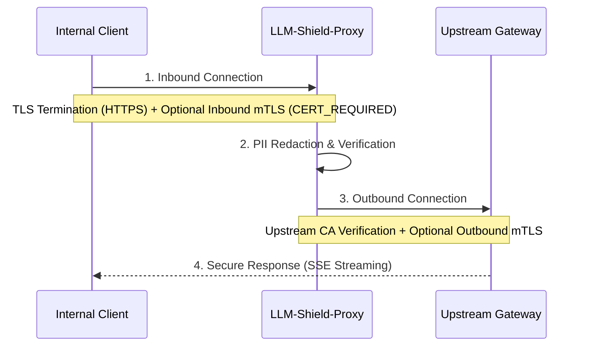

# TLS and mTLS Configuration

LLM-Shield-Proxy exposes documented inbound TLS/mTLS and outbound trust/client-certificate options. A secure deployment also requires protocol/cipher policy, identity mapping, revocation, key custody, rotation, ingress behavior, and network controls.

## Architectural Overview

The proxy can terminate TLS on inbound connections and configure certificate verification or a
client certificate on outbound connections. `uvicorn` handles the inbound listener; `httpx` and
Python SSL contexts handle the supported outbound path.

### Request Flow Diagram



## Inbound TLS Configuration (Server-Side)

### Standard TLS Termination (HTTPS)
To run the proxy over HTTPS, provide the server's public certificate and private key.
```bash
llm-shield-proxy --tls-cert-file /path/to/server.crt --tls-key-file /path/to/server.key
```
*Alternatively via Environment Variables:* `TLS_CERT_FILE` and `TLS_KEY_FILE`.

### Inbound Mutual TLS (mTLS)
To require client certificates, provide the CA bundle that the inbound listener should trust.

Providing `--client-ca-file` configures `ssl.CERT_REQUIRED`, so the TLS handshake rejects clients that do not present a certificate accepted by the configured trust store. Certificate validity still depends on trust, revocation strategy, identity mapping, and server configuration.
```bash
llm-shield-proxy \
  --tls-cert-file /path/to/server.crt \
  --tls-key-file /path/to/server.key \
  --client-ca-file /path/to/ca.pem
```
*Alternatively via Environment Variables:* `CLIENT_CA_FILE`.

## Outbound TLS Configuration (Client-Side)

### Upstream Certificate Verification
By default, the proxy verifies upstream LLM provider certificates using standard system roots. In an air-gapped environment or when routing to internal enterprise API gateways, you can supply a custom CA root bundle:
```bash
llm-shield-proxy --ca-bundle-file /path/to/corporate-root-ca.pem
```
*Alternatively via Environment Variable:* `CA_BUNDLE_FILE`.

For local development or specialized testing, you can bypass outbound verification:
```bash
llm-shield-proxy --insecure-skip-verify
```
*Alternatively via Environment Variable:* `INSECURE_SKIP_VERIFY=true`.

### Outbound Mutual TLS (mTLS)
If your upstream API gateway (e.g., an internal corporate firewall or proxy) requires LLM-Shield-Proxy itself to authenticate, provide the proxy's client certificate and key.

The proxy passes these file paths to the asynchronous HTTP client as its client-certificate
configuration.
```bash
export OUTBOUND_CLIENT_CERT=/path/to/proxy-client.crt
export OUTBOUND_CLIENT_KEY=/path/to/proxy-client.key
llm-shield-proxy
```

## Practical effect

Standard TLS authenticates the server to the client. Mutual TLS also requires the client to
present a certificate.

1. **Inbound mTLS** rejects clients whose certificates are not accepted by the configured trust
   store. Application authorization still requires a separate identity-to-policy mapping.
2. **Outbound custom CAs and mTLS** let the proxy use a selected trust bundle and present a client
   certificate. Authorization, revocation, name constraints, key custody, and routing remain
   separate controls.
