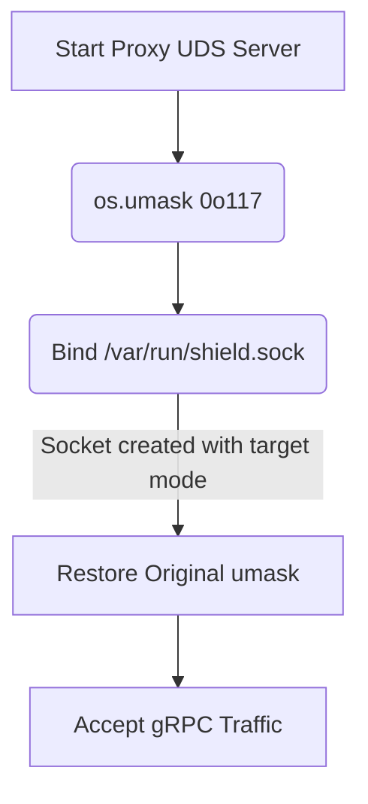

# UDS Socket TOCTOU Hardening

[⬅️ Back to Features Catalog](/docs/features-overview)

## What It Does
**UDS socket permission hardening** sets a restrictive process umask before creating the Unix
socket. This removes the create-then-`chmod` interval in which the socket could have broader file
permissions. It does not prevent every local privilege-escalation or inter-process attack.

## How It Works
A common vulnerability when creating Unix Domain Sockets in Linux is the TOCTOU race condition. If an application creates a socket at `/var/run/shield.sock` and *then* calls `chmod` to restrict access, there is a split-second window where a malicious local process can connect to the socket before the permissions are tightened.

1. **Set the umask:** Before creating the socket, the proxy calls `os.umask(0o117)`.
2. **Create the socket:** The OS applies the umask during creation, producing `rw-rw----` (660)
   permissions on the supported platform and configuration.
3. **Reduced permission window:** Applying a restrictive process umask before socket creation avoids the specific create-then-chmod window. It does not address compromised peer containers, shared UID/GID choices, host administrators, or every local IPC threat.
4. **Context Restoration:** The proxy immediately restores the original umask so that subsequent file operations (like audit logging) behave normally.

View diagram on GitHub mobile 📱 -->

## Performance Profile
- **Performance:** Workload and environment dependent; measure this path under the published benchmark protocol.
- **Overhead:** Setting and restoring the umask adds startup work. This path is not measured as
  zero cost.

## Configuration Flags

| Environment Variable | Description | Linked Deployment Guide |
| :--- | :--- | :--- |
| `EXT_PROC_SOCK_PATH` | The Unix Domain Socket path (default `/var/run/llm-shield/ext_proc.sock`). | [View in deployment.md](/docs/deployment) |

## Critical Logic & Edge Cases
* **File Cleanup:** Handled shutdown paths unlink the socket. Abrupt termination can leave a stale path, so startup must also handle stale sockets safely.
* **Container context:** This protection is most relevant on a shared volume such as `emptyDir`. UID/GID, mount permissions, Linux security controls, and host administration determine which peers can access the socket.

## FAQ

**Q: Do I need to worry about this if I'm just running the proxy on port 8000?**
A: No. This control applies only to the Unix socket used by the
[gRPC `ext_proc` integration](./service-mesh-native-grpc-ext-proc-integration). TCP listeners use
different access controls and risks.

## Practical effect
Applying a restrictive umask before creating the Unix socket avoids a create-then-chmod permission window. It is one local hardening measure rather than a complete defense against a compromised host or peer container.

## Related Tests
Tests: [`tests/test_security_hardening.py`](https://github.com/ninadphalak/LLM-Shield-Proxy/blob/main/tests/test_security_hardening.py).
