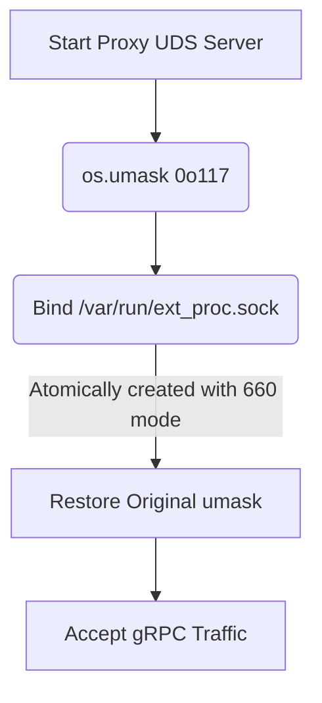

# UDS Socket TOCTOU Hardening

[⬅️ Back to Features Catalog](/docs/features-overview)

## What It Does
When the proxy creates a Unix Domain Socket (UDS) for the Envoy `ext_proc` integration, it uses process umask hardening to prevent a Time-of-Check to Time-of-Use (TOCTOU) permission race condition.

## How It Works
A common vulnerability when creating a Unix Domain Socket is creating the file with default (broad) permissions and then subsequently calling `chmod` to restrict access. This leaves a split-second window where a malicious local process can connect to the socket before the permissions are tightened.

1. **Set the umask:** Before creating the socket, the proxy sets the process umask to `0o117`.
2. **Create the socket:** The OS applies the umask during file creation, atomically producing restrictive `rw-rw----` (660) permissions.
3. **Restore Context:** The proxy immediately restores the original umask so that subsequent file operations (like audit logging) behave normally.

## Performance Profile
- **Overhead:** Negligible. The system calls (`umask`) run exactly once during startup.

## Configuration Flags

| Environment Variable | Description |
| :--- | :--- |
| `EXT_PROC_SOCK_PATH` | The Unix Domain Socket path (default `/var/run/llm-shield/ext_proc.sock`). |

## Implementation Details & Edge Cases
* **Container Context:** This defense mitigates a specific race condition. However, if multiple containers share the same volume (e.g., a Kubernetes `emptyDir`), you must still ensure that only authorized containers run with the correct UID/GID to access the 660-permissioned socket.

## FAQ

**Q: Do I need to worry about this if I'm just running the HTTP proxy on port 8000?**
A: No. This hardening applies specifically to the Unix Domain Socket used by the gRPC `ext_proc` integration.

## Practical Effect
This is a defense-in-depth measure that prevents local privilege escalation attacks during the split-second startup window of the gRPC socket.

## Related Tests
Tests: [`tests/test_security_hardening.py`](https://github.com/ninadphalak/LLM-Shield-Proxy/blob/main/tests/test_security_hardening.py).
