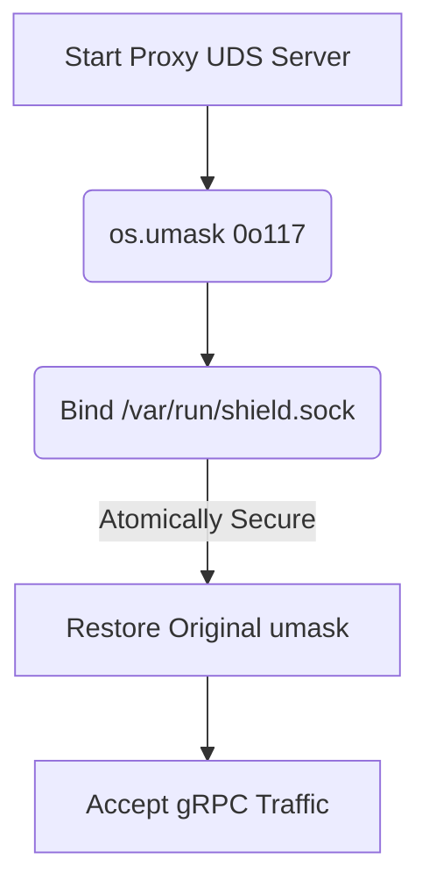

# UDS Socket TOCTOU Hardening

[⬅️ Back to Features Catalog](/docs/features-overview)

## What It Does
**UDS Socket TOCTOU (Time-of-Check to Time-of-Use) Hardening** is a highly specific, OS-level security feature. When running the proxy in Service Mesh mode using a Unix Domain Socket (UDS) instead of a TCP port, this feature prevents local privilege escalation attacks by securely managing socket file permissions at the kernel level.

## How It Works
A common vulnerability when creating Unix Domain Sockets in Linux is the TOCTOU race condition. If an application creates a socket at `/var/run/shield.sock` and *then* calls `chmod` to restrict access, there is a split-second window where a malicious local process can connect to the socket before the permissions are tightened.

1. **Pre-Emptive Umask:** Before the proxy instructs the OS to create the UDS file, it explicitly executes `os.umask(0o117)`.
2. **Atomic Creation:** The kernel uses the umask to atomically create the socket file with strict `rw-rw----` (660) permissions natively.
3. **Race Condition Eliminated:** Because the file is created with restricted permissions from the very first CPU cycle, the TOCTOU window is physically impossible.
4. **Context Restoration:** The proxy immediately restores the original umask so that subsequent file operations (like audit logging) behave normally.

View diagram on GitHub mobile 📱 -->

## Performance Profile
- **Execution Speed:** Executed once at startup; takes `0ms`.
- **Overhead:** Zero.

## Configuration Flags

| Environment Variable | Description | Linked Deployment Guide |
| :--- | :--- | :--- |
| `UDS_SOCKET_PATH` | The path for the Unix Domain Socket (e.g., `/var/run/shield.sock`). | [View in deployment.md](/docs/deployment) |

## Critical Logic & Edge Cases
* **File Cleanup:** The proxy binds to signal handlers to ensure that if the proxy crashes or receives a `SIGTERM`, it executes `os.unlink()` to delete the `.sock` file from the filesystem. This prevents "Address already in use" errors on subsequent restarts.
* **Docker Context:** This protection is most relevant when the proxy shares a volume mount (like an `emptyDir`) with another container (e.g., an Envoy sidecar) in a Kubernetes pod. It ensures only containers running as the correct UID/GID can access the memory buffers.

## FAQ

**Q: Do I need to worry about this if I'm just running the proxy on port 8000?**
A: No. This specific hardening technique only applies when you are using the [Service Mesh Native gRPC ext_proc Integration](./service-mesh-native-grpc-ext-proc-integration) via Unix Domain Sockets, as TCP ports do not suffer from file-level permission race conditions.

## Plainspeak
This feature closes a tiny, split-second window of vulnerability when the proxy turns on.

When a program creates a communication pipe (a socket), there is sometimes a millisecond delay between creating the pipe and locking it with a password. A very fast hacker on the same machine could jump into the pipe during that unprotected millisecond. This feature uses advanced operating system commands to ensure the pipe is born completely locked down from the very first nanosecond.

## Related Tests
See the following test file for reference implementations and edge-case testing: [`tests/test_security_hardening.py`](https://github.com/YOUR_ORG/LLM-Shield-Proxy/blob/main/tests/test_security_hardening.py).
