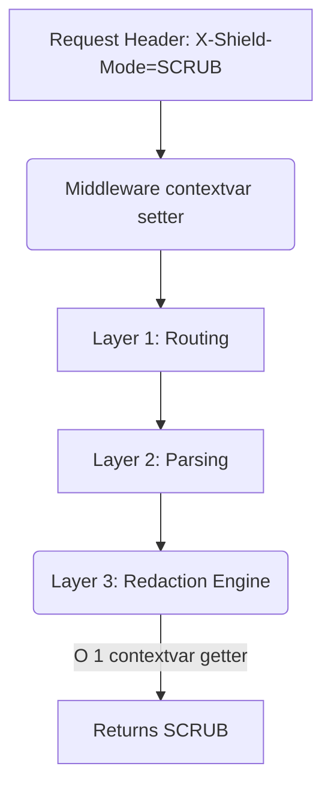

# Request-Scoped Dynamic Override Engine

[⬅️ Back to Features Catalog](/docs/features-overview)

## What It Does
The **Request-Scoped Dynamic Override Engine** exposes a documented allowlist of settings through policy and request context. Security-sensitive, process-start, connection-pool, and resource-lifecycle settings are not automatically safe to override; add tests before extending the allowlist.

## How It Works
Passing a user's specific override preferences down through 15 layers of nested function calls (Router -> Middleware -> Redaction Engine -> SSE Buffer -> Network Egress) creates messy, unmaintainable code.

1. **Context Initialization:** When a request is received, the proxy extracts specific HTTP headers (like `X-Shield-Masking-Mode`) or tenant-specific settings from the policy YAML.
2. **Contextvars Injection:** These overrides are injected into Python `contextvars.ContextVar` objects at the very top of the call stack.
3. **Request-local retrieval:** The streaming path reads the request's `ContextVar` value without a network lookup. Correct isolation still depends on setting and resetting context at every task and background-work boundary.

View diagram on GitHub mobile 📱 -->

## Performance Profile
- **Performance:** Workload and environment dependent; measure this path under the published benchmark protocol.
- **Overhead:** `ContextVar` lookup and context propagation still perform work. Compare the selected design in a representative profile before claiming a performance benefit.

## Critical Logic & Edge Cases
* **Off-loop context:** `contextvars` do not automatically propagate through every executor pattern. Documented off-loop paths can use `copy_context().run()`; add concurrency tests for new background paths.
* **Resolution priority:** Priority is defined per supported setting and code path. Do not infer a project-wide hierarchy for fields resolved at startup or outside request context.

## FAQ

**Q: Can a client use this to override their rate limits?**
A: Client headers should be restricted to explicitly documented fields such as the masking-mode header. Verify the current allowlist and authentication path in code and tests; do not expose keys, rate limits, destinations, or security scopes without a separate threat review.

## Plainspeak
This feature supports selected request-scoped behavior without passing each value through every function signature.

The engine supports request-scoped overrides for authorized settings. Operators must restrict which identities and fields can override policy and test task isolation under concurrency.

## Related Tests
See the following test file for reference implementations and edge-case testing: [`tests/test_policy_engine.py`](https://github.com/ninadphalak/LLM-Shield-Proxy/blob/main/tests/test_policy_engine.py).
