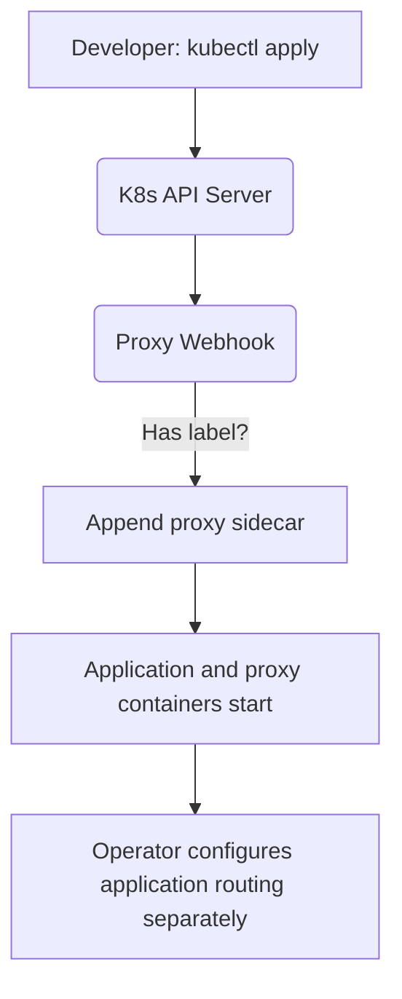

# Kubernetes Mutating Webhook

[⬅️ Back to Features Catalog](/docs/features-overview)

## What It Does
The **Kubernetes Mutating Webhook** returns a JSON Patch that appends one proxy container to a matching Pod. It does not edit the application container, redirect traffic, inject an API base URL, or create a service mesh rule.

## How It Works
Teams with many workloads can use admission mutation to add a consistent proxy sidecar. Application routing still needs an explicit, tested configuration.

1. **Admission Interception:** When a developer runs `kubectl apply -f deployment.yaml`, the Kubernetes API server pauses the deployment and sends the pod manifest to the proxy's webhook endpoint.
2. **Label trigger:** The proxy checks whether the Pod object has the label `llm-shield.io/inject: "true"`.
3. **Sidecar patch:** If the label exists and no container named `llm-shield-proxy` is already present, the route appends a container using `K8S_SIDECAR_IMAGE`, port `8000`, `SHIELD_FAILURE_MODE=FAIL_CLOSED`, `ENABLE_TIER3_ONNX_NER=false`, and fixed CPU/memory requests and limits.
4. **Admission result:** Kubernetes applies the returned patch when it accepts the admission response. The application still uses its original network configuration until an operator separately points its SDK or service-mesh route at the proxy.

View diagram on GitHub mobile 📱 -->

## Performance Profile
- **Performance:** Workload and environment dependent; measure this path under the published benchmark protocol.
- **Overhead:** Admission adds a network call, JSON parsing, validation, and patch generation. Measure API-server admission latency and define timeout/failure policy deliberately.

## Configuration Flags

| Environment Variable | Description | Linked Deployment Guide |
| :--- | :--- | :--- |
| `K8S_WEBHOOK_AUTH_TOKEN` | Optional bearer or `x-webhook-token` credential for `/v1/k8s/mutate`. If unset, the route is reachable without application-layer authentication. | [View in deployment.md](/docs/deployment) |
| `K8S_SIDECAR_IMAGE` | Image placed in the appended container. Pin a tested digest for deployment rather than relying on a mutable tag. | [View in deployment.md](/docs/deployment) |

## Critical Logic & Edge Cases
* **Helm behavior:** `webhook.enabled` defaults to `false`. When enabled, the deploy chart renders a certificate mount, TLS command arguments for the shared FastAPI listener, `/v1/k8s/mutate`, and the selected Service port in the `MutatingWebhookConfiguration`. This source contract has not yet been installed in a real cluster in the current verification pass.
* **Certificates:** With `webhook.certManager.enabled=false`, Helm generates a CA and serving certificate on first install, reuses the existing Secret on upgrades, and places that same CA in `caBundle`. With cert-manager enabled, `webhook.certManager.issuerRef.name` is required and cert-manager supplies the Secret and CA injection.
* **Existing container:** A Pod that already contains a container named `llm-shield-proxy` receives no patch. The route does not verify that the existing container has the desired image or settings.
* **Authentication:** Kubernetes does not normally attach the custom bearer token used by `K8S_WEBHOOK_AUTH_TOKEN`. Do not set that variable on this admission endpoint unless an intermediary is configured to add it.

## FAQ

**Q: Does the current patch automatically route the application through the sidecar?**
A: No. It appends the proxy container but does not rewrite the application container's environment or enforce network routing. Configure the SDK endpoint or service-mesh routing separately and verify the resulting path.

**Q: Do I have to use this feature?**
A: No. Helm, Kustomize, Terraform, or a service-mesh configuration can manage the sidecar and application routing instead.

## Practical effect
This endpoint can place the proxy container beside an application container. It does not make the application use that proxy. Routing, bypass prevention, resource planning, and compatibility testing remain separate deployment work.

## Related Tests
See [`tests/test_k8s_webhook.py`](https://github.com/ninadphalak/LLM-Shield-Proxy/blob/main/tests/test_k8s_webhook.py) for the returned patch, authentication, duplicate-name behavior, and Helm-to-FastAPI path/TLS contract.
