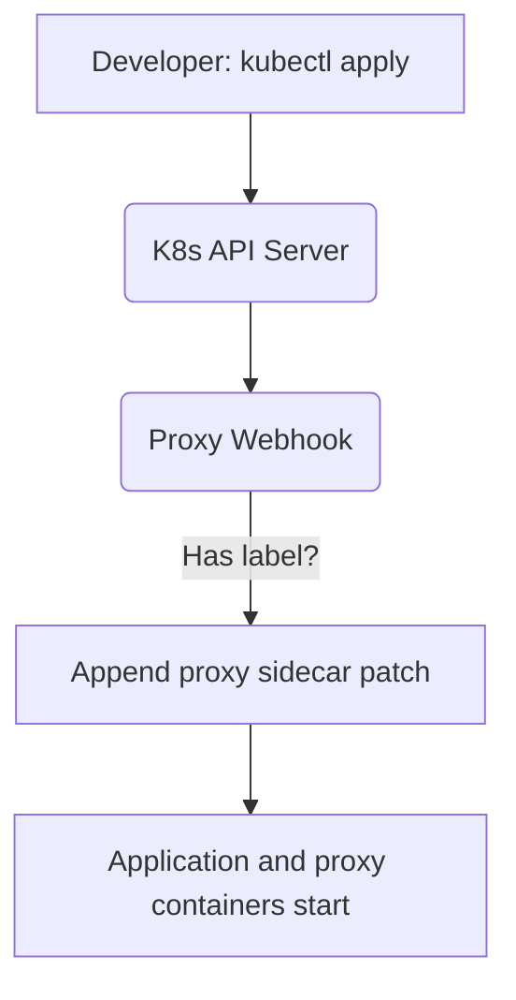

# Kubernetes Mutating Webhook

[⬅️ Back to Features Catalog](/docs/features-overview)

## What It Does
The proxy includes a **Kubernetes Mutating Webhook** endpoint. When registered in a cluster, this webhook automatically injects the LLM-Shield-Proxy container as a sidecar into any Pod matching specific labels.

## How It Works
For teams managing hundreds of deployments, manually editing YAML manifests to add the proxy sidecar is error-prone. The admission webhook automates this.

1. **Admission Interception:** When a developer deploys a Pod, the Kubernetes API Server intercepts the request and sends the manifest to the proxy's webhook endpoint (`/v1/k8s/mutate`).
2. **Label Trigger:** The proxy checks if the Pod has the label `llm-shield.io/inject: "true"`.
3. **Sidecar Patch:** If the label is present (and the proxy isn't already there), the webhook returns a JSON Patch that appends the `llm-shield-proxy` container to the Pod specification.
4. **Result:** Kubernetes applies the patch and starts the Pod with both the application and the proxy sidecar running together.

## Performance Profile
- **Overhead:** The API Server must wait for the webhook to respond before persisting the Pod, adding a few milliseconds to deployment times. It has no impact on application runtime traffic.

## Configuration Flags

| Environment Variable | Description |
| :--- | :--- |
| `K8S_SIDECAR_IMAGE` | The proxy container image digest to inject. |
| `K8S_WEBHOOK_AUTH_TOKEN` | Optional bearer token to authenticate incoming admission requests from the API Server. |

## Implementation Details & Edge Cases
* **No Automatic Routing:** The webhook *only* injects the proxy container. It does *not* automatically rewrite the application's environment variables (e.g., `OPENAI_BASE_URL`) or configure `iptables` rules. You must still configure your application to send traffic to `localhost:8000`.
* **Idempotency:** If the Pod already contains a container named `llm-shield-proxy`, the webhook skips injection to prevent conflicts.

## FAQ

**Q: Do I have to use this webhook feature?**
A: No. You can manage sidecar injection manually via Helm, Kustomize, or Terrafrom, or rely on a standard service mesh (like Istio) instead.

## Practical Effect
This feature automates the placement of the proxy sidecar across a large fleet of Kubernetes workloads based on simple namespace or pod labels.

## Related Tests
Tests: [`tests/test_k8s_webhook.py`](https://github.com/ninadphalak/LLM-Shield-Proxy/blob/main/tests/test_k8s_webhook.py).
