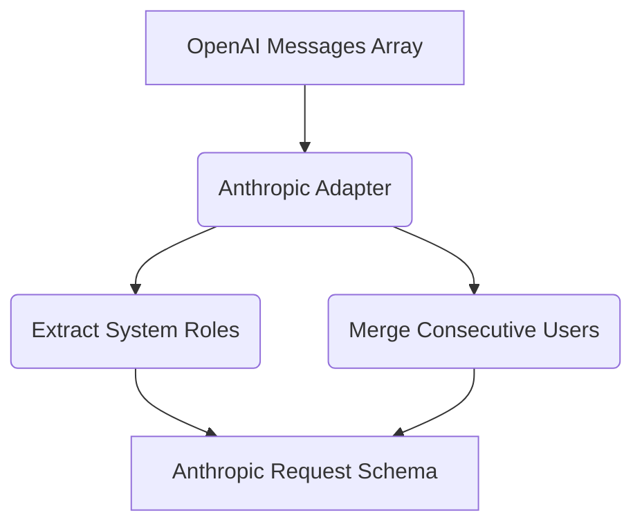

# Anthropic Adapter Implementation

[⬅️ Back to Features Catalog](/docs/features-overview)

## What It Does
The **Anthropic Adapter Implementation** translates a documented subset of OpenAI-style chat fields and Anthropic response events. It can support selected clients without an Anthropic SDK, but it does not cover every OpenAI or Anthropic feature and does not remove semantic differences between models.

## How It Works
Anthropic's Messages API enforces several strict contracts that the OpenAI API does not. The adapter normalizes these differences at the network edge:

1. **System Prompt Extraction:** OpenAI allows multiple `system` messages anywhere in the array. Anthropic requires a top-level `system` string. The adapter extracts all `system` roles, concatenates them safely, and lifts them to the root JSON object.
2. **Strict Alternation (User/Assistant):** Claude rejects requests where two `user` messages occur consecutively. The adapter detects this and merges consecutive contents, separated by newlines, into a single valid message block.
3. **Multi-Content Block Normalization:** Anthropic streams back complex events like `message_start`, `content_block_start`, `content_block_delta`, and `message_delta`. The adapter's asynchronous generator converts these proprietary events back into standard OpenAI `choices[0].delta.content` Server-Sent Events (SSE) chunks on the fly.

View diagram on GitHub mobile 📱 -->

## Performance Profile
- **Performance:** Workload and environment dependent; measure this path under the published benchmark protocol.
- **Overhead:** Avoids unnecessary full-payload duplication; measure allocations and RSS for the intended payload distribution.

## Configuration Flags
The adapter engages automatically when the proxy detects an Anthropic target URL.

| Environment Variable | Description | Linked Deployment Guide |
| :--- | :--- | :--- |
| `ANTHROPIC_API_VERSION` | Sets the `anthropic-version` API header. Default: `2023-06-01`. | [View in deployment.md](/docs/deployment) |

## Critical Logic & Edge Cases
* **Tool calling:** The adapter maps documented tool-definition and tool-use fields between selected OpenAI-style and Anthropic envelopes. Test parallel calls, IDs, content blocks, streaming deltas, validation errors, and unsupported fields for the pinned provider version.

## FAQ

**Q: Can I use Claude 3.5 Sonnet directly from my existing OpenAI SDK?**
A: Yes! Set the model string in your SDK to `claude-3-5-sonnet-20240620`, point your base URL to the proxy, and the proxy will automatically route and translate the request to Anthropic.

**Q: Does Anthropic's SSE stream break the sliding-window buffer?**
A: The adapter normalizes supported Anthropic events before the rehydration buffer. Rehydration still depends on token preservation, event coverage, buffer behavior, and the selected masking mode; exercise provider-specific fragmentation fixtures.

## Plainspeak
This feature specifically handles the unique, strict conversational rules required by Anthropic's Claude AI.

Anthropic is extremely picky about how a conversation is formatted (for example, it requires exactly alternating "User" and "Assistant" messages). If your application sends messages out of order, Anthropic will reject them. This adapter acts as a smart editor, automatically reformatting and fixing your message history in real-time so that Anthropic accepts it without complaints.

## Related Tests
See the following test file for reference implementations and edge-case testing: [`tests/test_provider_adapters.py`](https://github.com/ninadphalak/LLM-Shield-Proxy/blob/main/tests/test_provider_adapters.py).
