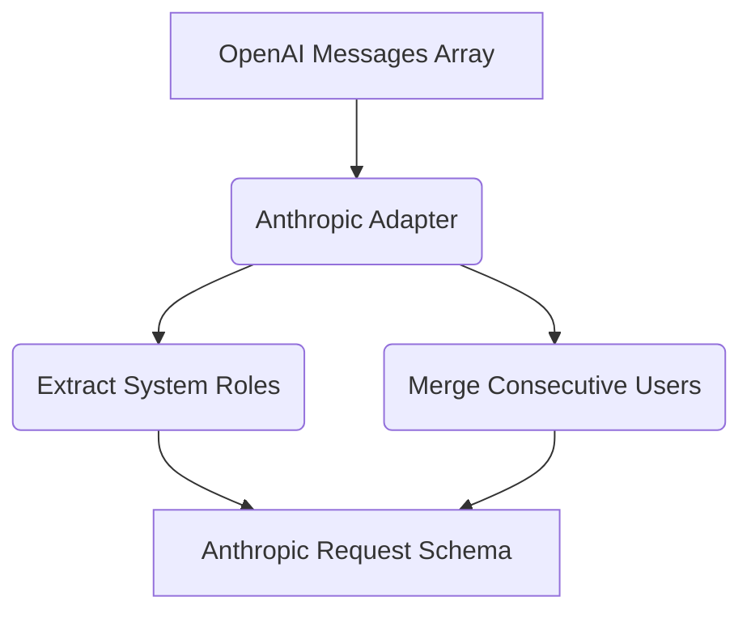

# Anthropic Adapter Implementation

[⬅️ Back to Features Catalog](/docs/features-overview)

## What It Does
The **Anthropic Adapter Implementation** provides translation between a documented subset of OpenAI-style chat fields and the Anthropic Messages API. This allows applications built for OpenAI to interface with Anthropic models without requiring an Anthropic-specific SDK. It is a structural adapter, not a semantic translator; it does not change the model's underlying behavior.

## How It Works
Anthropic's Messages API and OpenAI's Chat API use different JSON structures. The proxy translates requests on the fly:

1. **System Messages:** The adapter moves OpenAI-style `system` role messages to Anthropic's top-level `system` field.
2. **Role Sequencing:** Anthropic strictly requires alternating `user` and `assistant` roles. The adapter merges consecutive messages of the same role using newline separators to satisfy this constraint.
3. **Streaming Events:** The adapter converts Anthropic's SSE stream formats (like `content_block_delta`) back into OpenAI-compatible `choices[0].delta.content` chunks before returning them to the client.

## Performance Profile
- **Overhead:** The translation occurs in-memory. It introduces minor CPU allocations for string manipulation and JSON reconstruction.

## Configuration Flags
The adapter engages automatically when the proxy detects an Anthropic target URL.

| Environment Variable | Description | Linked Guide |
| :--- | :--- | :--- |
| `ANTHROPIC_API_VERSION` | Sets the `anthropic-version` HTTP header sent upstream (Default: `2023-06-01`). | [View in deployment.md](/docs/deployment) |

## Implementation Details & Edge Cases
* **Tool Calling Mapping:** The adapter translates supported tool-definition and tool-use fields. You must test parallel calls, IDs, and validation errors for the exact Anthropic version you pin, as tool behavior differs slightly from OpenAI.

## FAQ

**Q: Can I use Claude 3.5 Sonnet directly from my existing OpenAI SDK?**
A: Yes, for the supported text-focused subset. However, you must thoroughly test all edge cases-especially tool calling and streaming behaviors-because the proxy adapter is not a flawless 1:1 compatibility layer.

**Q: Does Anthropic's SSE stream break the sliding-window buffer?**
A: No. The adapter normalizes the incoming Anthropic events into a standard structure *before* they hit the rehydration buffer, ensuring PII redaction rules still apply correctly.

## Practical Effect
This adapter translates a specific, documented subset of OpenAI request/response structures into Anthropic structures. It may merge messages or reorganize system content, which can subtly alter prompt semantics.

## Related Tests
Tests: [`tests/test_provider_adapters.py`](https://github.com/ninadphalak/LLM-Shield-Proxy/blob/main/tests/test_provider_adapters.py).
