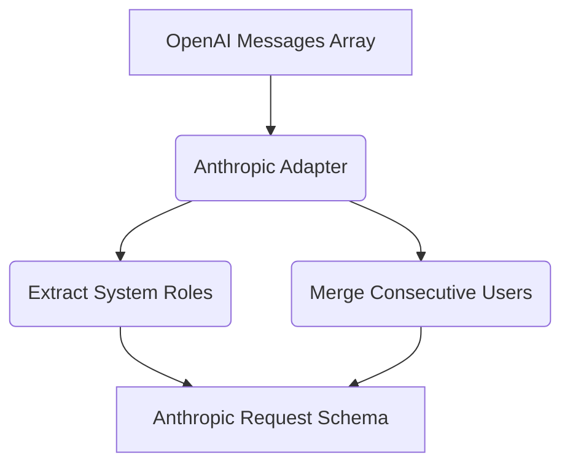

# Anthropic Adapter Implementation

[⬅️ Back to Features Catalog](/docs/features-overview)

## What It Does
The **Anthropic Adapter Implementation** translates a documented subset of OpenAI-style chat fields and Anthropic response events. It can support selected clients without an Anthropic SDK, but it does not cover every OpenAI or Anthropic feature and does not remove semantic differences between models.

## How It Works
Anthropic's Messages API and the OpenAI chat API use different request and streaming shapes. The
adapter translates the documented subset below:

1. **System messages:** The adapter moves supported OpenAI-style `system` content to Anthropic's
   top-level `system` field.
2. **Role sequence:** It merges consecutive messages with the same supported role using newline
   separators.
3. **Streaming events:** It converts supported Anthropic events such as `content_block_delta` into
   OpenAI-style `choices[0].delta.content` SSE events.

View diagram on GitHub mobile 📱 -->

## Performance Profile
- **Performance:** Workload and environment dependent; measure this path under the published benchmark protocol.
- **Overhead:** Avoids unnecessary full-payload duplication; measure allocations and RSS for the intended payload distribution.

## Configuration Flags
The adapter engages automatically when the proxy detects an Anthropic target URL.

| Environment Variable | Description | Linked Deployment Guide |
| :--- | :--- | :--- |
| `ANTHROPIC_API_VERSION` | Sets the `anthropic-version` API header. Default: `2023-06-01`. | [View in deployment.md](/docs/deployment) |

## Critical Logic & Edge Cases
* **Tool calling:** The adapter maps documented tool-definition and tool-use fields between selected OpenAI-style and Anthropic envelopes. Test parallel calls, IDs, content blocks, streaming deltas, validation errors, and unsupported fields for the pinned provider version.

## FAQ

**Q: Can I use Claude 3.5 Sonnet directly from my existing OpenAI SDK?**
A: The adapter is unit-tested for a text-focused subset but has not been validated against the
live Anthropic API. Check the current Anthropic model name and test every request field, tool,
streaming event, and error path you use.

**Q: Does Anthropic's SSE stream break the sliding-window buffer?**
A: The adapter normalizes supported Anthropic events before the rehydration buffer. Rehydration still depends on token preservation, event coverage, buffer behavior, and the selected masking mode; exercise provider-specific fragmentation fixtures.

## Practical effect
The adapter converts a documented subset of OpenAI-style messages and Anthropic streaming events.
It may merge messages or move system content, which can change semantics. It is not a complete
compatibility layer and must be tested against the pinned provider API.

## Related Tests
Tests: [`tests/test_provider_adapters.py`](https://github.com/ninadphalak/LLM-Shield-Proxy/blob/main/tests/test_provider_adapters.py).
