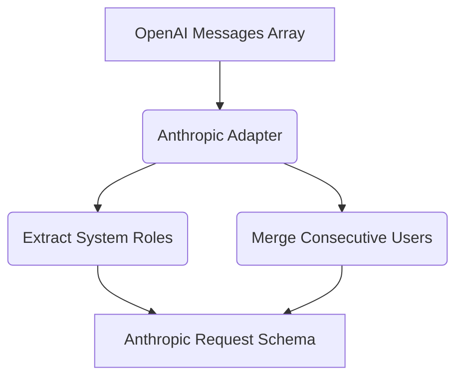

# Anthropic Adapter Implementation

[⬅️ Back to Features Catalog](../../../features-overview.md)

## What It Does
The **Anthropic Adapter Implementation** is a highly specialized protocol translator built natively into the proxy. It allows any OpenAI-compatible client to seamlessly interface with Anthropic's Claude API. It fundamentally bridges the gap between OpenAI's monolithic `messages` schema and Anthropic's distinct prompt engineering requirements.

## How It Works
Anthropic's Messages API enforces several strict contracts that the OpenAI API does not. The adapter normalizes these differences at the network edge:

1. **System Prompt Extraction:** OpenAI allows multiple `system` messages anywhere in the array. Anthropic requires a top-level `system` string. The adapter extracts all `system` roles, concatenates them safely, and lifts them to the root JSON object.
2. **Strict Alternation (User/Assistant):** Claude rejects requests where two `user` messages occur consecutively. The adapter detects this and merges consecutive contents, separated by newlines, into a single valid message block.
3. **Multi-Content Block Normalization:** Anthropic streams back complex events like `message_start`, `content_block_start`, `content_block_delta`, and `message_delta`. The adapter's asynchronous generator converts these proprietary events back into standard OpenAI `choices[0].delta.content` Server-Sent Events (SSE) chunks on the fly.

View diagram on GitHub mobile 📱 -->

## Performance Profile
- **Execution Speed:** Schema mapping adds nearly zero latency, operating in O(N) relative to the number of message objects in the array.
- **Overhead:** Uses zero-allocation techniques to prevent massive payload duplication in memory.

## Configuration Flags
The adapter engages automatically when the proxy detects an Anthropic target URL.

| Environment Variable | Description | Linked Deployment Guide |
| :--- | :--- | :--- |
| `ANTHROPIC_VERSION` | Sets the `anthropic-version` API header. Default: `2023-06-01`. | [View in deployment.md](../../deployment.md) |

## Critical Logic & Edge Cases
* **Tool Calling (Function Calling) Compatibility:** The adapter is fully aware of Anthropic's tool-use XML and JSON specifications, successfully mapping OpenAI's `tools` array into Anthropic's format, and parsing Claude's tool execution requests back into standard OpenAI JSON-RPC payloads.

## FAQ

**Q: Can I use Claude 3.5 Sonnet directly from my existing OpenAI SDK?**
A: Yes! Set the model string in your SDK to `claude-3-5-sonnet-20240620`, point your base URL to the proxy, and the proxy will automatically route and translate the request to Anthropic.

**Q: Does Anthropic's SSE stream break the sliding-window buffer?**
A: No. The adapter normalizes Anthropic's stream into standard chunks *before* it passes them into the SSE Rehydration Buffer, ensuring that PII de-masking works flawlessly across providers.

## Plainspeak
This feature specifically handles the unique, strict conversational rules required by Anthropic's Claude AI.

Anthropic is extremely picky about how a conversation is formatted (for example, it requires exactly alternating "User" and "Assistant" messages). If your application sends messages out of order, Anthropic will reject them. This adapter acts as a smart editor, automatically reformatting and fixing your message history in real-time so that Anthropic accepts it without complaints.

## Related Tests
See the following test file for reference implementations and edge-case testing: [`tests/test_provider_adapters.py`](../../../tests/test_provider_adapters.py).
