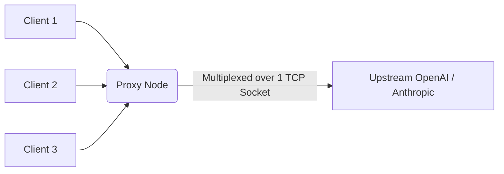

# HTTP/2 Upstream Connection Pooling

[⬅️ Back to Features Catalog](/docs/features-overview)

## What It Does
**HTTP/2 Upstream Connection Pooling** lets the shared HTTP client reuse eligible connections and negotiate HTTP/2 with supporting upstreams. Reuse depends on origins, pool limits, idle expiry, failures, intermediaries, and provider behavior.

## How It Works
New TCP/TLS handshakes add environment-dependent latency. Reusing eligible connections avoids repeating that setup work.

1. **Persistent Sockets:** The proxy's `httpx.AsyncClient` is configured to hold long-lived `keep-alive` sockets open.
2. **HTTP/2 Multiplexing:** Under HTTP/2, multiple concurrent LLM streams are multiplexed simultaneously over a single, highly efficient TCP connection, eliminating the head-of-line blocking problem inherent in older HTTP/1.1 proxies.
3. **Connection Re-Use:** When an eligible pooled connection exists, the proxy can reuse it instead of creating a new TCP/TLS connection.

View diagram on GitHub mobile 📱 -->

## Performance Profile
- **Performance:** Workload and environment dependent; measure this path under the published benchmark protocol.
- **Overhead:** Extremely efficient memory usage; maintaining 1,000 HTTP/2 streams on a single socket consumes a fraction of the resources compared to 1,000 separate TCP sockets.

## Configuration Flags

| Environment Variable | Description | Linked Deployment Guide |
| :--- | :--- | :--- |
| `HTTP_MAX_CONNECTIONS` | Maximum number of concurrent connections in the pool (default: 1000). | [View in deployment.md](/docs/deployment) |
| `HTTP_MAX_KEEPALIVE_CONNECTIONS` | Number of persistent idle connections to keep warm (default: 200). | [View in deployment.md](/docs/deployment) |

## Critical Logic & Edge Cases
* **Connection draining (SIGTERM):** The proxy gives existing streams up to `DRAIN_TIMEOUT_SECONDS` before closing the pool. Completion also depends on the Kubernetes grace period, endpoint propagation, upstream/client behavior, and stream duration.
* **Timeouts & Stale Sockets:** The proxy actively prunes dead or hanging sockets utilizing exponential backoff and precise read/write/connect timeouts to prevent resource exhaustion.

## FAQ

**Q: Do I need to enable HTTP/2 on my upstream provider manually?**
A: The HTTP client can negotiate protocol support through TLS/ALPN. Confirm the negotiated protocol and reuse behavior in your environment because providers, gateways, proxies, and client configuration can change the result.

**Q: Does this help if I am using a local vLLM or Ollama instance?**
A: Yes! Even on a local loopback interface, connection pooling eliminates TCP handshake overhead, increasing your total tokens-per-second (TPS) throughput dramatically.

## Plainspeak
This feature acts like a permanent carpool lane for internet traffic, making communication much faster.

Normally, every time your app asks the AI a question, it has to spend time "shaking hands" and setting up a secure connection over the internet, which takes a split second. This feature sets up a secure connection once, keeps it open, and forces all future questions to share that exact same connection simultaneously. This eliminates the repetitive setup delays.

## Related Tests
See the following test file for reference implementations and edge-case testing: [`tests/test_transport.py`](https://github.com/ninadphalak/LLM-Shield-Proxy/blob/main/tests/test_transport.py).
