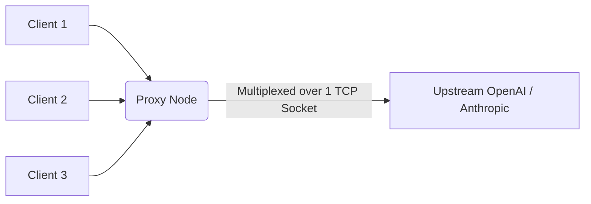

# HTTP/2 Upstream Connection Pooling

[⬅️ Back to Features Catalog](/docs/features-overview)

## What It Does
**HTTP/2 Upstream Connection Pooling** configures the proxy's internal HTTP client to reuse long-lived TCP/TLS sockets and multiplex concurrent requests. This eliminates the latency overhead of establishing new handshakes for every outbound request.

## How It Works
Establishing a new HTTPS connection requires TCP handshakes and TLS cryptographic negotiation. Pooling avoids repeating this work.

1. **Persistent Sockets:** The proxy's `httpx.AsyncClient` is configured to maintain long-lived `keep-alive` TCP connections with upstream providers.
2. **HTTP/2 Multiplexing:** If the upstream provider supports HTTP/2, the proxy leverages multiplexing to carry multiple concurrent streams over a single TCP connection. (Note: A failure of the underlying TCP socket will impact all multiplexed streams).
3. **Connection Re-Use:** When an eligible idle connection exists in the pool, the proxy routes new outbound requests through it instantly.

## Performance Profile
- **Performance Benefits:** Avoids environment-dependent TLS handshake latency.
- **Resource Constraints:** Connection pools consume sockets and memory. The configured maximum connection limit acts as a strict ceiling.

## Configuration Flags

| Environment Variable | Description | Linked Guide |
| :--- | :--- | :--- |
| `HTTP_MAX_CONNECTIONS` | Maximum number of concurrent connections in the pool (default: 1000). | [View in deployment.md](/docs/deployment) |
| `HTTP_MAX_KEEPALIVE_CONNECTIONS` | Number of persistent idle connections to keep warm (default: 200). | [View in deployment.md](/docs/deployment) |

## Implementation Details & Edge Cases
* **Graceful Draining (SIGTERM):** During shutdown, the proxy allows existing streams to finish within the `DRAIN_TIMEOUT_SECONDS` window before forcefully severing the `httpx` pool.
* **Timeout Disciplines:** The client enforces strict connect, read, and write timeouts. Stale sockets or partial network failures rely on standard TCP retransmission and proxy retry logic to recover.

## FAQ

**Q: Do I need to enable HTTP/2 on my upstream provider manually?**
A: No. The proxy's HTTP client negotiates protocol support automatically via TLS/ALPN. However, intermediate gateways or proxies in your network architecture may downgrade the connection to HTTP/1.1.

**Q: Does this help if I am using a local vLLM or Ollama instance?**
A: Yes, if the local inference server supports HTTP keep-alives. While loopback network latency is negligible, avoiding TLS handshakes (if configured) still saves CPU cycles.

## Practical Effect
The proxy maintains a warm pool of connections to upstream models. When HTTP/2 is negotiated, it multiplexes traffic efficiently, drastically lowering TTFT (Time To First Token) by removing transport-layer setup time.

## Related Tests
Tests: [`tests/test_transport.py`](https://github.com/ninadphalak/LLM-Shield-Proxy/blob/main/tests/test_transport.py).
