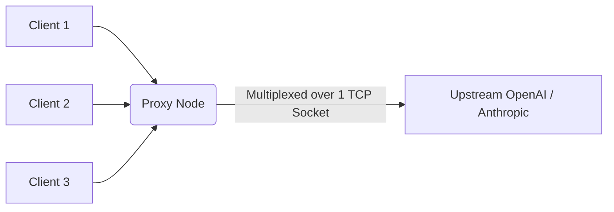

# HTTP/2 Upstream Connection Pooling

[⬅️ Back to Features Catalog](/docs/features-overview)

## What It Does
**HTTP/2 Upstream Connection Pooling** lets the shared HTTP client reuse eligible connections and negotiate HTTP/2 with supporting upstreams. Reuse depends on origins, pool limits, idle expiry, failures, intermediaries, and provider behavior.

## How It Works
New TCP/TLS handshakes add environment-dependent latency. Reusing eligible connections avoids repeating that setup work.

1. **Persistent Sockets:** The proxy's `httpx.AsyncClient` is configured to hold long-lived `keep-alive` sockets open.
2. **HTTP/2 multiplexing:** A supporting upstream can carry multiple concurrent streams on one
   connection. This avoids HTTP/1.1's one-active-response-per-connection limit, but packet loss and
   connection failure can still affect every stream on that TCP connection.
3. **Connection Re-Use:** When an eligible pooled connection exists, the proxy can reuse it instead of creating a new TCP/TLS connection.

View diagram on GitHub mobile 📱 -->

## Performance Profile
- **Performance:** Workload and environment dependent; measure this path under the published benchmark protocol.
- **Overhead:** Pool state and active streams consume sockets, memory, and CPU. The configured
  limit of 1,000 connections is a ceiling, not evidence that one socket will carry 1,000 streams
  efficiently.

## Configuration Flags

| Environment Variable | Description | Linked Deployment Guide |
| :--- | :--- | :--- |
| `HTTP_MAX_CONNECTIONS` | Maximum number of concurrent connections in the pool (default: 1000). | [View in deployment.md](/docs/deployment) |
| `HTTP_MAX_KEEPALIVE_CONNECTIONS` | Number of persistent idle connections to keep warm (default: 200). | [View in deployment.md](/docs/deployment) |

## Critical Logic & Edge Cases
* **Connection draining (SIGTERM):** The proxy gives existing streams up to `DRAIN_TIMEOUT_SECONDS` before closing the pool. Completion also depends on the Kubernetes grace period, endpoint propagation, upstream/client behavior, and stream duration.
* **Timeouts and stale sockets:** The HTTP client applies configured read, write, connect, and pool
  timeouts. Retry and connection cleanup behavior must be tested during partial failures.

## FAQ

**Q: Do I need to enable HTTP/2 on my upstream provider manually?**
A: The HTTP client can negotiate protocol support through TLS/ALPN. Confirm the negotiated protocol and reuse behavior in your environment because providers, gateways, proxies, and client configuration can change the result.

**Q: Does this help if I am using a local vLLM or Ollama instance?**
A: It can avoid repeated connection setup when the local server supports keep-alive. The effect on
throughput depends on the server, protocol, concurrency, response generation, and payload. Measure
it; loopback does not guarantee a meaningful gain.

## Practical effect
The shared client reuses eligible upstream connections. With HTTP/2, a supporting upstream may
carry several streams on one connection. Pool expiry, failures, origin changes, and server limits
can still create new connections.

## Related Tests
See the following test file for reference implementations and edge-case testing: [`tests/test_transport.py`](https://github.com/ninadphalak/LLM-Shield-Proxy/blob/main/tests/test_transport.py).
