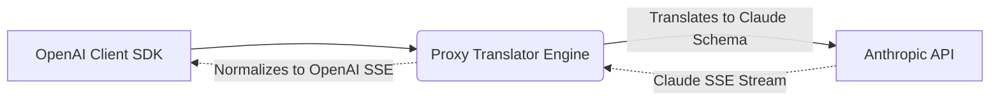

# Multi-Provider Translators

[⬅️ Back to Features Catalog](/docs/features-overview)

## What It Does
The **Multi-Provider Translators** feature adapts supported OpenAI-style request and streaming fields to selected non-OpenAI provider formats. Compatibility is limited to implemented and tested fields; it is not a universal API contract.

## How It Works
Client applications shouldn't need to rewrite their network logic when switching LLM providers. The proxy handles this dynamically at the network edge:

1. **Schema Interception:** The proxy receives standard OpenAI `v1/chat/completions` JSON payloads.
2. **Translation Layer:** Before egress, the payload is translated into the target provider's specific schema (e.g., extracting the `system` role out of the messages array for Anthropic).
3. **SSE Stream Normalization:** As the upstream provider streams its unique format back (e.g., Anthropic's `content_block_delta`), the proxy translates these events back into standard OpenAI `choices[0].delta.content` chunks, allowing the downstream application to parse them without errors.

View diagram on GitHub mobile 📱 -->

## Performance Profile
- **Performance:** Workload and environment dependent; measure this path under the published benchmark protocol.
- **Overhead:** Uses `orjson` for serialization. Translation is still CPU and allocation work; measure it and offload any workload that can monopolize the event-loop thread.

## Configuration Flags

| Environment Variable | Description | Linked Deployment Guide |
| :--- | :--- | :--- |
| `UPSTREAM_BASE_URL` | The URL of the target LLM provider (e.g., `https://api.anthropic.com`). | [View in deployment.md](/docs/deployment) |
| `UPSTREAM_API_KEY` | The exact API key for the target upstream provider. | [View in deployment.md](/docs/deployment) |

## Critical Logic & Edge Cases
* **Role Alternation:** Some providers (like Anthropic) enforce strict alternating `user` and `assistant` roles. The translator automatically collapses consecutive `user` messages into a single block to prevent API 400 errors.
* **Feature parity:** Configured adapters can remove unsupported parameters, but removal can change semantics and does not establish that the upstream request will succeed.

## FAQ

**Q: Do I need to change my `langchain` or `openai` Python SDK code?**
A: For the supported path, start by pointing the client's `base_url` to the proxy. Then test authentication, model names, tools, structured output, streaming, errors, retries, and any provider-specific fields your application uses.

**Q: How does this interact with PII redaction?**
A: The documented ingress path transforms configured content before provider translation, and the response path normalizes provider output before supported rehydration. Exercise each provider envelope and content type because adapters can expose different fields.

## Practical effect
Providers expose different request fields, streaming events, tool semantics, and error behavior. The implemented adapters translate a documented subset; applications must test unsupported fields and semantic differences before switching providers.

## Related Tests
See the following test file for reference implementations and edge-case testing: [`tests/test_provider_adapters.py`](https://github.com/ninadphalak/LLM-Shield-Proxy/blob/main/tests/test_provider_adapters.py).
