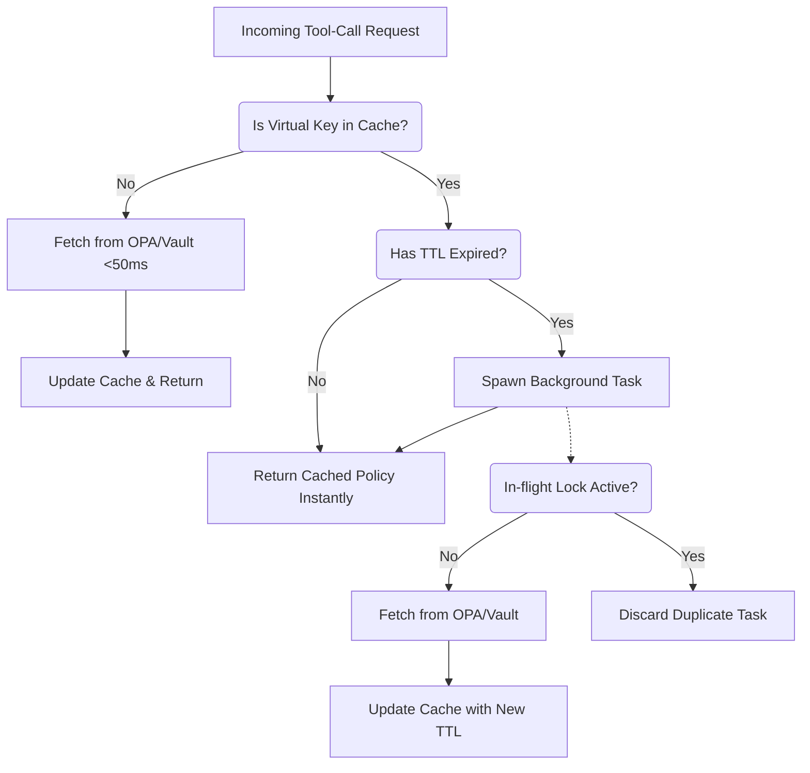

# OPA & Vault Stale-While-Revalidate RBAC Resolvers

[⬅️ Back to Features Catalog](/docs/features-overview)

## What It Does
LLM-Shield-Proxy features a highly optimized Pluggable RBAC Engine for tool-call governance. Starting in version 1.3, it supports asynchronous, high-performance resolvers for **Open Policy Agent (OPA)** and **HashiCorp Vault**.

Traditional API gateways query policy engines synchronously. If a policy engine or secret store is under heavy load or experiences network latency, that latency is passed directly to the LLM streaming client. For ultra-low latency streaming architecture, a 50ms-100ms penalty on the first byte is unacceptable. This feature solves this by implementing an atomic, non-blocking **Stale-While-Revalidate** caching mechanism, guaranteeing sub-millisecond policy resolution without stalling the event loop.

## How It Works
The OPA and Vault resolvers operate on a deterministic architecture designed for zero synchronous blocking:

1. **O(1) Atomic Dictionary Swaps:** Resolved tenant policies are stored in a local `MappingProxyType` dictionary, ensuring zero-locking read access and microsecond lookup speeds.
2. **Asynchronous Background Refresh:** When an incoming stream requests a policy, the proxy checks the cache TTL. If expired, it immediately returns the *stale* policy from cache (0ms latency penalty) while spawning an asynchronous background task (`_safe_background_fetch`) to query the external policy server.
3. **Strict Network Deadlines:** Uncached queries to external providers use a strict `&lt;50ms` timeout to ensure the event loop is never stalled.

## Performance Profile
- **Execution Speed:** O(1) memory lookup when cached, resulting in `0ms` network latency penalty on the hot path.
- **Overhead:** Maintains zero local file descriptor leaks during high-volume background polling by utilizing HTTP/2 persistent connection pooling (`httpx.AsyncClient`) via the FastAPI application lifespan.

## Configuration Flags

| Environment Variable | Description | Linked Deployment Guide |
| :--- | :--- | :--- |
| `OPA_URL` | The URL to your OPA server (e.g., `http://opa:8181/v1/data/shield/rbac`). | [View in deployment.md](/docs/deployment) |
| `ENABLE_VAULT_SECRETS` | Set to `True` to activate Vault integration. | [View in deployment.md](/docs/deployment) |
| `VAULT_ADDR` | The HashiCorp Vault server address. | [View in deployment.md](/docs/deployment) |
| `VAULT_TOKEN` | The HashiCorp Vault authentication token. | [View in deployment.md](/docs/deployment) |
| `RBAC_CACHE_TTL_SECONDS` | Controls how long a policy remains fresh before requiring a background revalidation (default `300`). | [View in deployment.md](/docs/deployment) |

## Critical Logic & Edge Cases
* **Thundering Herd Prevention:** The background fetch uses an `_inflight` state tracker. If 1,000 concurrent streaming requests hit the proxy for the same expired tenant key, only *one* background task is dispatched to OPA or Vault, shielding your backend infrastructure from spike loads.
* **Fail-Closed Resilience:** If the background task encounters a network error, `CancelledError`, or unhandled exception, it logs a WORM-compliant `rbac_background_fetch_critical_failure` event to the audit trail (without leaking Vault secrets) and gracefully sets a short 5-second TTL retry window to prevent permanent cache staleness.

## FAQ

**Q: Will users notice a delay if the OPA server is down?**
A: No, for existing sessions. If a user's policy is already in the cache, the proxy serves the stale policy instantly. The background fetch will fail, log the failure, and try again in 5 seconds without blocking the user.

**Q: What happens if a brand new tenant connects and OPA is unreachable?**
A: Because the tenant is not in the cache, the request blocks for a strict 50ms timeout. If OPA does not respond, the proxy fails closed, returning a deterministic `_FAIL_CLOSED_` policy that explicitly denies all tool-call access to ensure security is never compromised.

**Q: Are Vault tokens or OPA responses logged to the console?**
A: No. The integration includes a `log_security_event` method that emits structured, tampered-proof WORM JSON logs for audit purposes without leaking raw payloads or secrets into standard output.

## Plainspeak
This feature connects the proxy's security checks to the massive, enterprise-grade permission databases that large companies already use (like HashiCorp Vault or Open Policy Agent).

Instead of forcing a company to recreate all of their security rules from scratch inside the proxy, this feature acts as a lightning-fast bridge. It instantly asks the company's main security database, "Is this user allowed to do this?" and securely caches the answer so it doesn't slow down the chat.

## Related Tests
See the following test file for reference implementations and edge-case testing: [`tests/test_security_hardening.py`](https://github.com/YOUR_ORG/LLM-Shield-Proxy/blob/main/tests/test_security_hardening.py).
