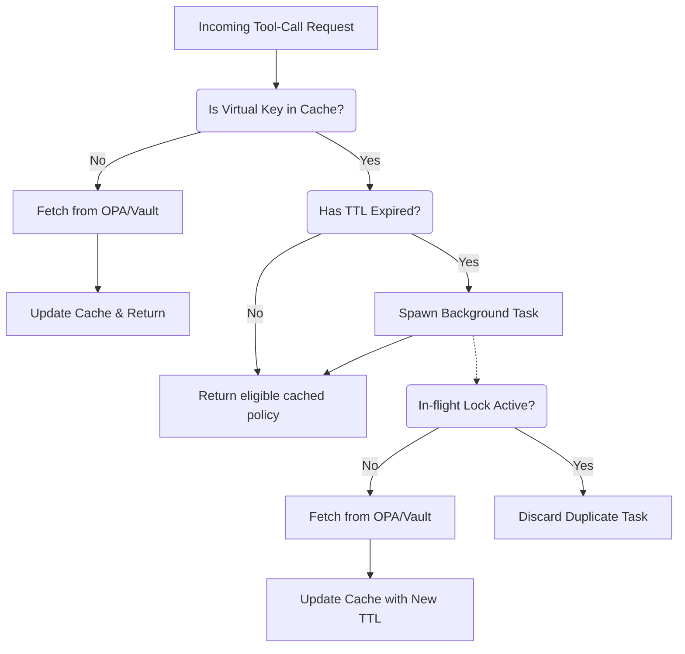

# OPA & Vault Stale-While-Revalidate RBAC Resolvers

[⬅️ Back to Features Catalog](/docs/features-overview)

## What It Does
LLM-Shield-Proxy includes asynchronous policy resolvers for **Open Policy Agent (OPA)** and
**HashiCorp Vault**. They supply allow and deny data to supported tool-call governance paths.

Remote policy engines can add first-byte latency when they are slow or unavailable. This resolver uses bounded asynchronous queries and stale-while-revalidate caching; measure the resulting latency and verify its fail-closed behavior in the target environment.

## How It Works
The OPA and Vault resolvers use asynchronous network calls and local cached snapshots:

1. **Snapshot replacement:** Resolved tenant policies are stored in a local `MappingProxyType`
   snapshot. Refresh replaces the active snapshot without mutating it in place.
2. **Asynchronous Background Refresh:** When an incoming stream requests a policy, the proxy checks the cache TTL. If expired, it can return the stale policy while spawning an asynchronous background task (`_safe_background_fetch`) to query the external policy server.
3. **Network Deadlines:** Uncached queries use configured timeouts. Async I/O avoids blocking the event-loop thread, but callers still wait for resolution and consume connection and task resources.

## Performance Profile
- **Performance:** Workload and environment dependent; measure this path under the published benchmark protocol.
- **Overhead:** The application reuses a managed `httpx.AsyncClient`, but network calls, pool
  state, cache refresh, task scheduling, and backend processing still consume resources. Monitor
  file descriptors and connection cleanup under load.

## Configuration Flags

| Environment Variable | Description | Linked Deployment Guide |
| :--- | :--- | :--- |
| `OPA_URL` | The URL to your OPA server (e.g., `http://opa:8181/v1/data/shield/rbac`). | [View in deployment.md](/docs/deployment) |
| `ENABLE_VAULT_SECRETS` | Set to `True` to activate Vault integration. | [View in deployment.md](/docs/deployment) |
| `VAULT_ADDR` | The HashiCorp Vault server address. | [View in deployment.md](/docs/deployment) |
| `VAULT_TOKEN` | The HashiCorp Vault authentication token. | [View in deployment.md](/docs/deployment) |
| `RBAC_CACHE_TTL_SECONDS` | Controls how long a policy remains fresh before requiring a background revalidation (default `300`). | [View in deployment.md](/docs/deployment) |

## Critical Logic & Edge Cases
* **Duplicate refresh control:** The `_inflight` tracker allows one background refresh per key at
  a time. It does not prevent load across different keys, processes, or replicas.
* **Fail-Closed Resilience:** If the background task encounters a network error, `CancelledError`, or unhandled exception, it emits a privacy-safe `rbac_background_fetch_critical_failure` audit event and sets a short retry window to prevent permanent cache staleness.

## FAQ

**Q: Will users notice a delay if the OPA server is down?**
A: Cached-policy behavior depends on resolver configuration, cache age, and failure mode. Document the stale-while-revalidate window, test expiry and revocation, and decide whether the selected control should fail closed instead.

**Q: What happens if a brand new tenant connects and OPA is unreachable?**
A: An uncached request waits up to the configured deadline. For the documented fail-closed resolver path, timeout returns a deny policy; verify exception, cancellation, cache, and fallback behavior for the selected resolver.

**Q: Are Vault tokens or OPA responses logged to the console?**
A: The resolver is not intended to log tokens or full policy responses. Validate logs, errors,
traces, and custom transports with secret fixtures. The default audit path is best effort;
immutable retention requires a separate configured store.

## Practical effect
The resolver can query an external policy or secret system and cache supported results. Authorization latency, cache staleness, revocation, availability, and failure behavior require deployment-specific tests.

## Related Tests
See the following test file for reference implementations and edge-case testing: [`tests/test_security_hardening.py`](https://github.com/ninadphalak/LLM-Shield-Proxy/blob/main/tests/test_security_hardening.py).
