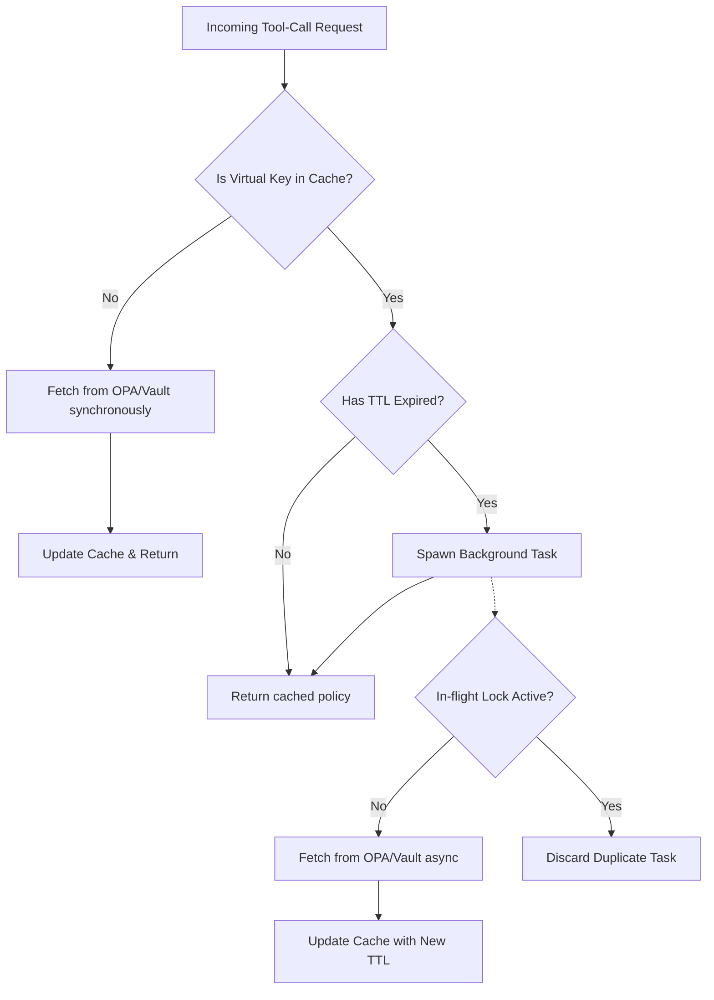

# OPA & Vault Stale-While-Revalidate RBAC Resolvers

[⬅️ Back to Features Catalog](/docs/features-overview)

## What It Does
The proxy includes asynchronous policy resolvers for **Open Policy Agent (OPA)** and **HashiCorp Vault**. These resolvers supply allow/deny data for tool-call governance. To prevent remote policy engines from adding latency to every request, the proxy uses a stale-while-revalidate caching mechanism.

## How It Works
Querying an external policy server on the critical path adds unacceptable first-byte latency. The proxy uses local caching and asynchronous background fetches.

1. **Snapshot Replacement:** Resolved tenant policies are stored in a local, read-only memory snapshot. 
2. **Asynchronous Background Refresh:** When an incoming request asks for a policy, the proxy checks the cache TTL. If expired, it returns the slightly stale policy to the client immediately while spawning a non-blocking background task to fetch the fresh policy from OPA or Vault.
3. **Network Deadlines:** Uncached queries (e.g., the very first request for a tenant) must wait for the network call. These use strict configured timeouts to prevent hanging the event loop.

## Performance Profile
- **Overhead:** Background refreshes consume HTTP connections, CPU time, and task scheduler overhead, but do not block the latency-sensitive request path.

## Configuration Flags

| Environment Variable | Description | Linked Guide |
| :--- | :--- | :--- |
| `OPA_URL` | The URL to your OPA server. | [View in deployment.md](/docs/deployment) |
| `ENABLE_VAULT_SECRETS` | Set to `True` to activate Vault integration. | [View in deployment.md](/docs/deployment) |
| `VAULT_ADDR` | The HashiCorp Vault server address. | [View in deployment.md](/docs/deployment) |
| `VAULT_TOKEN` | The HashiCorp Vault authentication token. | [View in deployment.md](/docs/deployment) |
| `RBAC_CACHE_TTL_SECONDS` | How long a policy remains fresh before triggering a background revalidation (default `300`). | [View in deployment.md](/docs/deployment) |

## Implementation Details & Edge Cases
* **Duplicate Refresh Control:** An in-flight lock prevents the proxy from launching multiple concurrent background refreshes for the same tenant key. 
* **Fail-Closed Resilience:** If the background task encounters a network error, it logs an audit event and sets a short retry window. It does not crash the proxy.

## FAQ

**Q: Will users notice a delay if the OPA server is down?**
A: If the policy is already cached, users will not notice a delay; the proxy will serve the stale policy while the background task retries and fails silently. If the policy is *not* cached, the request will hang until the network timeout is reached and then fail closed (deny access).

**Q: Are Vault tokens or OPA responses logged to the console?**
A: No. The resolver is designed not to log raw tokens or full policy responses.

## Practical Effect
This caching strategy decouples external authorization latency from LLM request latency. Policies are kept fresh in the background, ensuring high performance without sacrificing governance, though it accepts a narrow window of eventual consistency during policy revocation.

## Related Tests
Tests: [`tests/test_security_hardening.py`](https://github.com/ninadphalak/LLM-Shield-Proxy/blob/main/tests/test_security_hardening.py).
