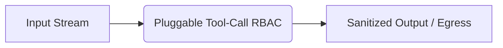

# Pluggable Tool-Call RBAC (MCP Governance)

[⬅️ Back to Features Catalog](/docs/features-overview)

## What It Does
The **Pluggable Tool-Call RBAC (MCP Governance)** feature enforces access control on Model Context Protocol (MCP) tool execution. It evaluates incoming tool call requests on the `/v1/mcp` route against a configured policy resolver (In-Memory, Redis, OPA, or Vault) to determine if the specific tenant is authorized to use the requested tool.

## How It Works
The proxy intercepts tool execution payloads before they reach the downstream MCP server.

1. **Initialization:** The proxy reads `policies.yaml` or `.env` to determine which resolver class to instantiate.
2. **Execution:** When a request hits `/v1/mcp`, the proxy queries the resolver to see if the caller's Virtual Key is authorized to execute the requested tool name.
3. **Completion:** If authorized, the payload is forwarded. If denied, the proxy rejects the request immediately.

## Performance Profile
- **Overhead:** Latency depends heavily on the chosen resolver. Memory and Redis resolvers are fast, while network-bound OPA/Vault resolvers rely on caching to maintain throughput.

## Configuration Flags

| Environment Variable | Description | Linked Guide |
| :--- | :--- | :--- |
| `OPA_URL` | Selects the OPA resolver if configured. | [View in deployment.md](/docs/deployment) |
| `REDIS_URL` | Enables Redis-backed resolvers if configured. | [View in deployment.md](/docs/deployment) |
| `MCP_EMPTY_ALLOWLIST_MODE` | Defaults to `DENY_ALL`. If set to `BLOCKLIST_ONLY`, any tool not explicitly blocked is allowed. | [View in deployment.md](/docs/deployment) |
| `UPSTREAM_MCP_BASE_URL` | Selects the upstream target for the scoped MCP gateway. | [View in the governance guide](/docs/guides/mcp-tool-governance) |

## Implementation Details & Edge Cases
* **Empty-Policy Default:** If a tenant has no policy defined, the default behavior is `DENY_ALL` (all tool calls are blocked). If you deploy in `BLOCKLIST_ONLY` mode, the proxy will emit a critical warning at startup because an empty policy will implicitly allow everything.
* **Startup Probe:** The application tests the policy resolver at startup using a sentinel request to verify connectivity and configuration.

## FAQ

**Q: Is `/v1/mcp` a complete MCP Server implementation?**
A: No. It acts as a specialized proxy route that supports a documented JSON-RPC subset for tool execution. It does not implement MCP capability negotiation, sessions, or every defined MCP method.

**Q: Where can I see the audit logs for this feature?**
A: Access decisions emit audit metadata. Delivery depends on your configured audit transport.

## Practical Effect
This feature acts as a strict policy checkpoint, ensuring agents can only execute tools they are explicitly authorized to use via the defined RBAC resolver.

## Related Tests
Tests: [`tests/test_proxy.py`](https://github.com/ninadphalak/LLM-Shield-Proxy/blob/main/tests/test_proxy.py).
