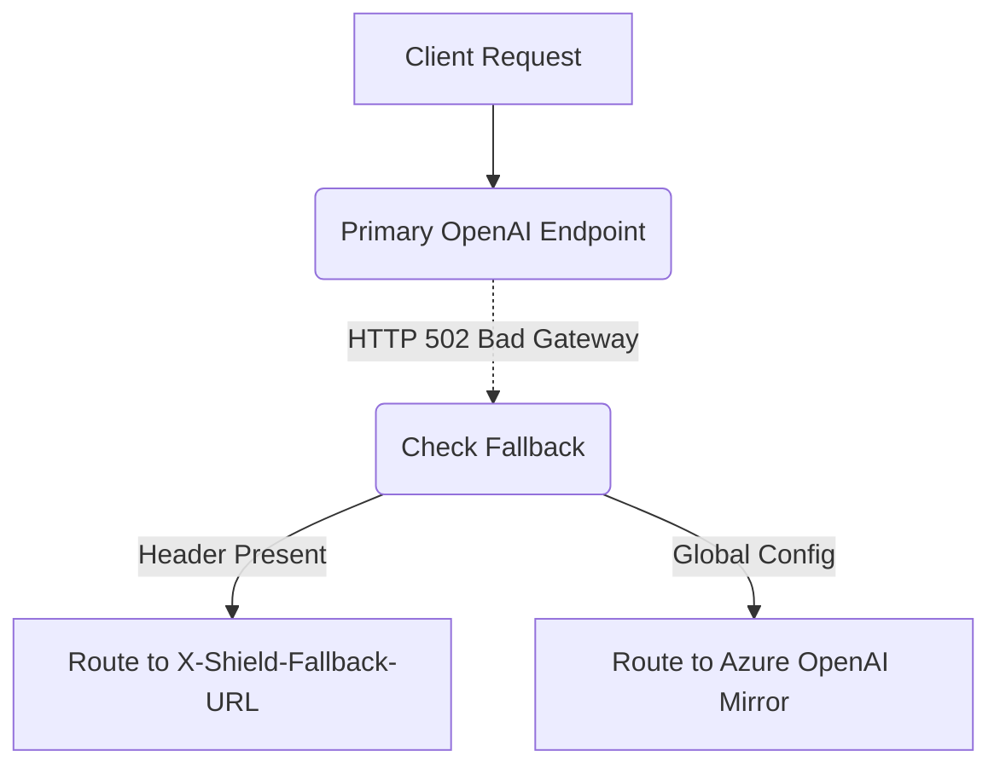

# Provider Failover with Per-Request Override

[⬅️ Back to Features Catalog](/docs/features-overview)

## What It Does
**Provider Failover with Per-Request Override** can route eligible requests to a configured secondary endpoint after selected failures. It does not establish zero downtime, provider equivalence, or successful replay.

## How It Works
A configured fallback gives selected failed requests a second route:

1. **Global fallback:** For configured eligible failures, the proxy can replay the request to
   `FALLBACK_BASE_URL`.
2. **Fallback credentials:** The failover path uses `FALLBACK_API_KEY` for the supported
   authentication header.
3. **Per-request override:** When client upstream overrides are enabled and authorized,
   `X-Shield-Fallback-URL` can select the fallback URL. Egress policy must approve the target.

View diagram on GitHub mobile 📱 -->

## Performance Profile
- **Performance:** Workload and environment dependent; measure this path under the published benchmark protocol.
- **Overhead:** Retry waits are asynchronous, but failover still keeps a request active and adds
  connection, latency, quota, and possible duplicate-work costs.

## Configuration Flags

| Environment Variable / Header | Description | Linked Deployment Guide |
| :--- | :--- | :--- |
| `FALLBACK_BASE_URL` | Global fallback provider URL if the primary fails. | [View in deployment.md](/docs/deployment) |
| `FALLBACK_API_KEY` | Secondary API key for the fallback provider. | [View in deployment.md](/docs/deployment) |
| `X-Shield-Fallback-URL` | Client HTTP header to dynamically override the fallback destination. | [View in POLICIES.md](/docs/policies) |

## Critical Logic & Edge Cases
* **Target approval:** Only use configured or authorized fallback URLs that pass egress checks.
  URL approval does not prove that the fallback model has equivalent quality, privacy, or policy.
* **Replay risk:** LLM requests are not inherently idempotent; a failed attempt may have reached the first provider or consumed quota. The configured predicate excludes handled 4xx client errors, but operators must assess duplication, billing, and side effects.

## FAQ

**Q: Can I use this to failover from OpenAI to Anthropic?**
A: Cross-provider fallback requires a configured adapter and can change supported parameters, model behavior, streaming envelopes, latency, and output. Test it as a distinct execution path and expose the failover to operators.

**Q: Does the client have to wait a long time during a failover?**
A: Failover begins after the configured failure predicate or timeout. A shorter timeout can increase false failovers and duplicate work; tune it from observed latency distributions.

## Practical effect
This feature provides an operator-configured secondary route for selected failures. Availability still depends on both providers, the network, credentials, models, quotas, and replay behavior.

For configured eligible failures, the proxy can attempt a pre-authorized fallback endpoint. The attempt adds latency, can fail, and may produce different model behavior. Per-request routing inputs must be authenticated and constrained by the SSRF and policy controls.

## Related Tests
Tests: [`tests/test_enterprise_resiliency.py`](https://github.com/ninadphalak/LLM-Shield-Proxy/blob/main/tests/test_enterprise_resiliency.py).
