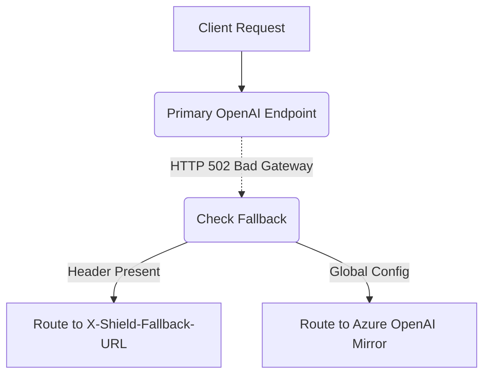

# Provider Failover with Per-Request Override

[⬅️ Back to Features Catalog](/docs/features-overview)

## What It Does
**Provider Failover with Per-Request Override** can route eligible requests to a configured secondary endpoint after selected failures. It does not establish zero downtime, provider equivalence, or successful replay.

## How It Works
Relying on a single AI provider introduces significant availability risks. This feature operates natively in the routing plane:

1. **Global Failover:** If `FALLBACK_BASE_URL` is configured, and a request to the primary `UPSTREAM_BASE_URL` returns a 50x server error or times out, the proxy automatically retries the identical request against the fallback endpoint.
2. **Key-Swapping:** When failing over, the proxy intelligently swaps the authentication header, replacing the primary `UPSTREAM_API_KEY` with the `FALLBACK_API_KEY`.
3. **Per-Request Client Override:** A client application can bypass the global configuration entirely by injecting the `X-Shield-Fallback-URL` HTTP header. The proxy prioritizes this header, enabling dynamic, client-driven routing.

View diagram on GitHub mobile 📱 -->

## Performance Profile
- **Performance:** Workload and environment dependent; measure this path under the published benchmark protocol.
- **Overhead:** Retries are managed via asynchronous jitter, ensuring failed requests do not block the connection pool.

## Configuration Flags

| Environment Variable / Header | Description | Linked Deployment Guide |
| :--- | :--- | :--- |
| `FALLBACK_BASE_URL` | Global fallback provider URL if the primary fails. | [View in deployment.md](/docs/deployment) |
| `FALLBACK_API_KEY` | Secondary API key for the fallback provider. | [View in deployment.md](/docs/deployment) |
| `X-Shield-Fallback-URL` | Client HTTP header to dynamically override the fallback destination. | [View in POLICIES.md](/docs/policies) |

## Critical Logic & Edge Cases
* **No Unapproved Downgrades:** The proxy will *only* failover to explicitly approved URLs. It protects enterprises from situations where an application silently downgrades to a weaker, cheaper model (e.g., GPT-4 to GPT-3.5) without security authorization.
* **Replay risk:** LLM requests are not inherently idempotent; a failed attempt may have reached the first provider or consumed quota. The configured predicate excludes handled 4xx client errors, but operators must assess duplication, billing, and side effects.

## FAQ

**Q: Can I use this to failover from OpenAI to Anthropic?**
A: Cross-provider fallback requires a configured adapter and can change supported parameters, model behavior, streaming envelopes, latency, and output. Test it as a distinct execution path and expose the failover to operators.

**Q: Does the client have to wait a long time during a failover?**
A: Failover begins after the configured failure predicate or timeout. A shorter timeout can increase false failovers and duplicate work; tune it from observed latency distributions.

## Plainspeak
This feature provides an operator-configured secondary route for selected failures. Availability still depends on both providers, the network, credentials, models, quotas, and replay behavior.

For configured eligible failures, the proxy can attempt a pre-authorized fallback endpoint. The attempt adds latency, can fail, and may produce different model behavior. Per-request routing inputs must be authenticated and constrained by the SSRF and policy controls.

## Related Tests
See the following test file for reference implementations and edge-case testing: [`tests/test_enterprise_resiliency.py`](https://github.com/ninadphalak/LLM-Shield-Proxy/blob/main/tests/test_enterprise_resiliency.py).
