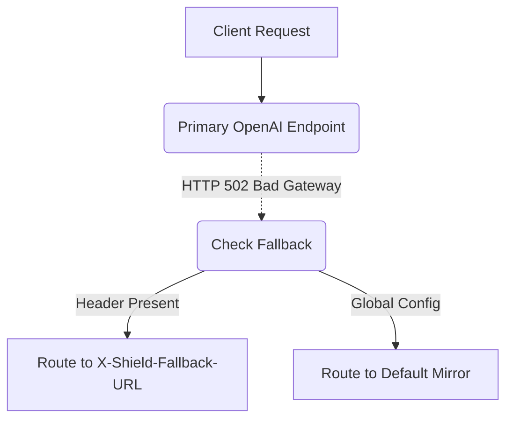

# Provider Failover with Per-Request Override

[⬅️ Back to Features Catalog](/docs/features-overview)

## What It Does
This feature extends the global provider failover routing by allowing client applications to explicitly dictate the fallback destination on a per-request basis. This provides a secondary route for failed requests, though it does not guarantee equivalent model behavior or successful completion.

## How It Works
A configured fallback gives eligible failed requests a second chance to succeed:

1. **Global Fallback:** For configured eligible failures (like HTTP 502/503), the proxy can replay the request to a globally defined `FALLBACK_BASE_URL`.
2. **Fallback Credentials:** The failover path automatically uses the configured `FALLBACK_API_KEY` for authentication.
3. **Per-Request Override:** If client upstream overrides are enabled and authorized via policy, a client can pass the `X-Shield-Fallback-URL` HTTP header. If the primary provider fails, the proxy will route the fallback request to the URL specified in this header rather than the global default.

## Performance Profile
- **Overhead:** Retries and failovers keep the request active on the event loop, adding latency and connection overhead.

## Configuration Flags

| Environment Variable / Header | Description | Linked Guide |
| :--- | :--- | :--- |
| `FALLBACK_BASE_URL` | Global fallback URL if the primary fails. | [View in deployment.md](/docs/deployment) |
| `FALLBACK_API_KEY` | Secondary API key for the global fallback provider. | [View in deployment.md](/docs/deployment) |
| `X-Shield-Fallback-URL` | Client HTTP header to dynamically override the fallback destination. | [View in POLICIES.md](/docs/policies) |

## Implementation Details & Edge Cases
* **Target Approval:** Egress policies must explicitly allow the URLs provided in `X-Shield-Fallback-URL`. The proxy will reject unauthorized override attempts.
* **Replay Risk:** LLM requests are not perfectly idempotent. While the proxy only retries on specific network/infrastructure errors, a failed attempt might have reached the provider and consumed quota before timing out.

## FAQ

**Q: Can I use this to failover from OpenAI to Anthropic?**
A: Cross-provider failover requires translation (via the Multi-Provider Translators). Test this path thoroughly, as different providers have different schema requirements, latency profiles, and model semantics.

**Q: Does the client have to wait a long time during a failover?**
A: Yes, failover adds the primary request's timeout to the secondary request's latency. You must tune timeouts to balance fast failures against false positives.

## Practical Effect
This feature allows client-side orchestration of resilience by giving applications the final say on where traffic should go if the primary provider fails. It does not magically fix failing queries or guarantee uptime.

## Related Tests
Tests: [`tests/test_enterprise_resiliency.py`](https://github.com/ninadphalak/LLM-Shield-Proxy/blob/main/tests/test_enterprise_resiliency.py).
