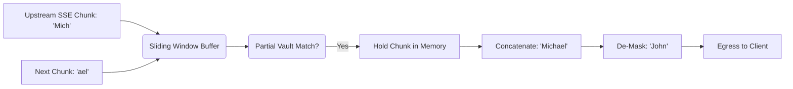

# SSE Sliding-Window Buffer

[⬅️ Back to Features Catalog](/docs/features-overview)

## What It Does
The **SSE Sliding-Window Buffer** retains bounded trailing overlap so supported protected tokens can be reassembled when SSE event boundaries split them. The repository reports environment-scoped component timings; it does not guarantee sub-millisecond end-to-end service latency.

## How It Works
Streaming transports can split a placeholder such as `[PERSON_1]` across events or byte chunks. A transformation that examines each chunk independently can miss the token, while whole-response buffering removes incremental delivery. Exact behavior and delay depend on framing, buffering, and the complete service path.

LLM-Shield-Proxy addresses the tested placeholder case with a sliding window:
1. **SSE event processing:** As response bytes are received through the HTTP client, the stream parser processes supported SSE `data:` payloads; the application does not directly observe raw TCP frame boundaries.
2. **Mathematical Overlap Retention:** The buffer evaluates the chunk against the Vault mappings, but *retains* a trailing overlap equal to $LL = max(0, max_token_length - 1).
3. **Prefix-aware rehydration:** The buffer retains bounded trailing prefixes so the published placeholder fixtures can be reconstructed across tested chunk splits.
4. **Bounded release:** Content that falls outside the retained lookahead window can be yielded downstream. Network, parser, scheduling, inspection, and buffer delay remain measurable.

View diagram on GitHub mobile 📱 -->

## Performance Profile
- **Performance:** Workload and environment dependent; measure this path under the published benchmark protocol.
- **Overhead:** Operates as a Python asynchronous generator without intentional synchronous network I/O in the loop. Parsing, allocation, scheduling, and replacement work remain measurable.

## Configuration Flags

| Environment Variable | Description | Linked Deployment Guide |
| :--- | :--- | :--- |
| `MAX_SSE_LINE_LENGTH` | Limits the maximum size of a single SSE frame to prevent buffer overflow attacks. | [View in deployment.md](/docs/deployment) |

## Critical Logic & Edge Cases
* **Slow or stalled streams:** HTTP client and proxy timeouts bound selected waits. Exercise slow headers, slow bodies, long model time-to-first-token, cancellation, pool exhaustion, and Envoy timeouts separately.
* **Non-Latin streaming:** The implementation includes specific ASCII/CJK boundary handling and multilingual fixtures. It is not a complete Unicode word-segmentation engine; add corpus-specific tests for scripts, normalization forms, combining marks, and token collisions.

## FAQ

**Q: Do I need to change my frontend code to support this streaming?**
A: The conformance fixtures validate OpenAI-style SSE framing for the tested paths. Client libraries, provider extensions, malformed events, cancellation, and custom protocols require integration tests.

**Q: What happens if the upstream provider sends malformed SSE JSON?**
A: Invalid JSON is handled according to the stream parser's tested error path. The conformance suite separately checks SSE syntax and reconstruction; the buffer must not be described as a general JSON repair mechanism.

**Q: Does this work for Anthropic responses?**
A: The adapter handles a documented subset of Anthropic event shapes. Test the selected model, tools, content blocks, errors, stop events, fragmentation, and provider-version changes before relying on rehydration.

## Plainspeak
This feature bounds placeholder lookahead while preserving incremental delivery in the tested fixtures. User-visible pacing and end-to-end latency depend on the complete service path.

An SSE response can split a sensitive token across chunks. The sliding window retains a configured suffix so supported matches can span boundaries, then yields older content. Coverage depends on window size, detector behavior, encoding, and provider framing; measure the added delay.

## Related Tests
See the following test file for reference implementations and edge-case testing: [`tests/test_streaming.py`](https://github.com/ninadphalak/LLM-Shield-Proxy/blob/main/tests/test_streaming.py).
