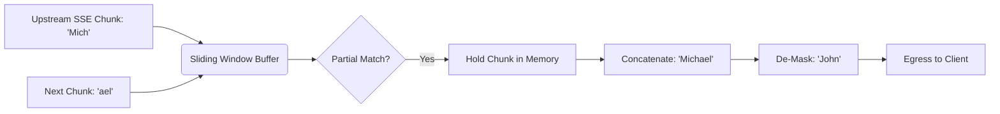

# SSE Sliding-Window Buffer

[⬅️ Back to Features Catalog](/docs/features-overview)

## What It Does
The **SSE Sliding-Window Buffer** prevents sensitive data leakage when streaming chunks split a PII token (e.g., `[EMAIL_1]`) across two separate network events. 

## How It Works
If a streaming payload is evaluated chunk-by-chunk without context, a split token like `[PER` and `SON_1]` will evade detection. Conversely, buffering the entire response defeats the purpose of streaming. The sliding window bridges this gap.

1. **Event Processing:** The proxy processes supported `data:` payloads as they arrive via Server-Sent Events (SSE).
2. **Mathematical Overlap Retention:** The buffer evaluates the current chunk, but holds back a trailing overlap equal to `max_token_length - 1`. 
3. **Split-Token Handling:** By holding the end of one chunk, the buffer can successfully identify and de-mask a token that is completed by the arrival of the next chunk.
4. **Bounded Release:** Content outside the lookahead window is yielded downstream. The buffer coalesces small chunks up to `MAX_SSE_LINE_LENGTH` before emitting them, ensuring the downstream client receives well-formed data without memory ballooning.

## Performance Profile
- **Overhead:** The buffer operates as an asynchronous Python generator. Parsing, allocating strings, and managing the window introduces measurable latency, though it avoids synchronous network I/O blocking.

## Configuration Flags

| Environment Variable | Description | Linked Guide |
| :--- | :--- | :--- |
| `MAX_SSE_LINE_LENGTH` | Bounds the unparsed input accumulator and output-coalescing target. | [View in deployment.md](/docs/deployment) |
| `MAX_PAYLOAD_SIZE_BYTES` | Bounds the total accepted request data and absolute output limits. | [View in deployment.md](/docs/deployment) |

## Implementation Details & Edge Cases
* **Expansion and Failure:** If a de-masked value is significantly longer than its synthetic replacement, the rehydrated line might exceed the `MAX_SSE_LINE_LENGTH`. If it exceeds the absolute `MAX_PAYLOAD_SIZE_BYTES` limit, the proxy will forcefully terminate the stream to prevent memory exhaustion.
* **Non-Latin Streaming:** The implementation handles ASCII/CJK boundaries, but it is not a complete Unicode word-segmentation engine. You must test corpus-specific scripts and combining marks.

## FAQ

**Q: Do I need to change my frontend code to support this streaming?**
A: No, the proxy emits standard OpenAI-style SSE framing. However, custom protocols, client library quirks, or malformed events require integration testing.

**Q: What happens if the upstream provider sends malformed SSE JSON?**
A: The buffer will fail and propagate the parsing error. It is not designed to repair invalid JSON syntax.

## Practical Effect
This feature safely rehydrates masked PII on streaming responses without waiting for the entire generation to finish. It preserves incremental streaming delivery while ensuring split tokens do not bypass redaction rules.

## Related Tests
Tests: [`tests/test_streaming.py`](https://github.com/ninadphalak/LLM-Shield-Proxy/blob/main/tests/test_streaming.py).
