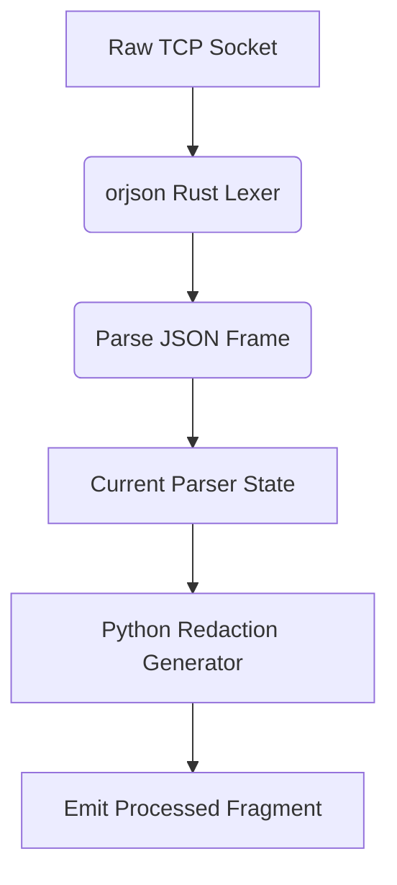

# Bounded Streaming JSON Lexer

[⬅️ Back to Features Catalog](/docs/features-overview)

## What It Does
The **Streaming JSON Lexer** parses incremental response events without retaining the complete response history. It uses `orjson` for JSON serialization and parsing where that code path applies.

## How It Works
This path processes supported JSON and SSE fragments incrementally so it does not retain the full
response history. Parsing still creates Python and native allocations.

1. **Native JSON implementation:** The lexer uses `orjson` on supported parsing paths.
2. **Bounded state:** Incremental parsing avoids retaining the full response history; allocations still occur and are measured by the conformance benchmark.
3. **SSE chunk parsing:** On supported paths, the lexer identifies `data:` content and processes fragments while retaining a bounded trailing window rather than the complete response history.

View diagram on GitHub mobile 📱 -->

## Performance Profile
- **Execution speed:** Uses native `orjson` parsing; comparative throughput depends on payload and environment.
- **Memory behavior:** Bounded parser state prevents retained input from growing with stream duration. Process RSS and concurrency capacity require the published service-level protocol.

## Configuration Flags
The lexer is part of the streaming path and has no separate enable flag.

## Critical Logic & Edge Cases
* **Invalid payload handling:** Malformed JSON can be rejected on paths that parse a complete JSON value. Confirm status codes and buffering behavior for request bodies, SSE fragments, and truncated streams separately.
* **Numeric limits:** Exercise unusually large integers, floats, nesting, and payload sizes against both the parser and the surrounding application limits; native parsing does not remove resource-exhaustion risk.

## FAQ

**Q: Why is bypassing the Python GIL so important?**
A: In asynchronous Python (`asyncio`), CPU-heavy parsing can block other work on the same event loop. Native parsing can reduce that cost, but concurrency capacity must be measured for the complete service and workload.

**Q: Are there any compatibility issues with `orjson`?**
A: JSON objects require string keys, but integration limits also include supported SSE framing, maximum line size, Unicode handling, nesting, provider-specific envelopes, and incomplete streams. Exercise the conformance fixtures and provider-specific tests.

**Q: Does this help protect against Denial of Service?**
A: Bounded parser state reduces one memory-growth risk, but it does not guarantee that a pod cannot run out of memory. Enforce payload and concurrency limits and validate peak RSS under load.

## Practical effect
Instead of retaining the complete response, it keeps only the state needed for the current parsing decision. It still allocates memory, so the conformance and service benchmarks report that behavior rather than calling it allocation-free.

## Related Tests
Tests: [`tests/test_streaming_json_lexer.py`](https://github.com/ninadphalak/LLM-Shield-Proxy/blob/main/tests/test_streaming_json_lexer.py).
