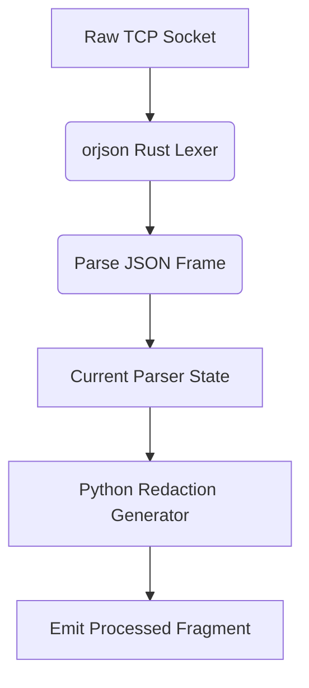

# Bounded Streaming JSON Lexer

[⬅️ Back to Features Catalog](/docs/features-overview)

## What It Does
The **Bounded Streaming JSON Lexer** incrementally parses inbound and outbound JSON and SSE payloads. By processing fragments instead of retaining the entire response history in memory, it reduces memory overhead on long-running LLM streams.

## How It Works
Standard JSON parsers require loading the entire JSON string into memory before processing. This lexer avoids that requirement on supported paths.

1. **Native JSON Implementation:** The lexer leverages the highly optimized `orjson` Rust library for core parsing paths.
2. **Bounded State:** The parser only retains enough state to make the current parsing decision. It processes fragments incrementally and discards them, preventing memory usage from growing linearly with the stream duration.
3. **SSE Chunk Parsing:** On streaming paths, it identifies `data:` blocks and yields them to the sliding window buffer without attempting to parse the entire HTTP body as a single object.

## Performance Profile
- **Execution Speed:** `orjson` provides native Rust parsing speeds, which generally outperforms standard library Python JSON parsing.
- **Memory Behavior:** Keeping state bounded prevents unbounded memory growth. However, string allocations still occur, and memory usage under load must be validated against the proxy's benchmark tests.

## Configuration Flags
The lexer is integrated directly into the streaming path and cannot be toggled off.

## Implementation Details & Edge Cases
* **Invalid Payload Handling:** Malformed JSON will throw a parsing exception. The proxy will reject malformed inbound requests with a `400` status code, and will sever upstream streams if the provider returns invalid JSON.
* **Numeric Limits:** Native parsing does not eliminate resource-exhaustion risks. Extremely large integers, deep nesting, or massive payload sizes can still strain the proxy.

## FAQ

**Q: Why is bypassing the Python GIL important here?**
A: In an `asyncio` architecture, CPU-heavy tasks like JSON parsing can block the event loop, stalling all other concurrent requests. Native Rust parsing executes faster and releases the GIL, significantly improving overall concurrency capacity.

**Q: Are there any compatibility issues with `orjson`?**
A: `orjson` strictly adheres to JSON standards (e.g., requiring string keys). Providers sending non-compliant JSON will cause parse errors.

**Q: Does this completely protect against Denial of Service (DoS)?**
A: No. While it mitigates one vector of memory exhaustion, the proxy is still susceptible to overload. You must deploy the proxy with strict payload limits and concurrency controls.

## Practical Effect
This feature allows the proxy to parse massive LLM responses incrementally. While it is highly efficient and reduces peak memory usage, it still incurs CPU and allocation costs that scale with traffic.

## Related Tests
Tests: [`tests/test_streaming_json_lexer.py`](https://github.com/ninadphalak/LLM-Shield-Proxy/blob/main/tests/test_streaming_json_lexer.py).
